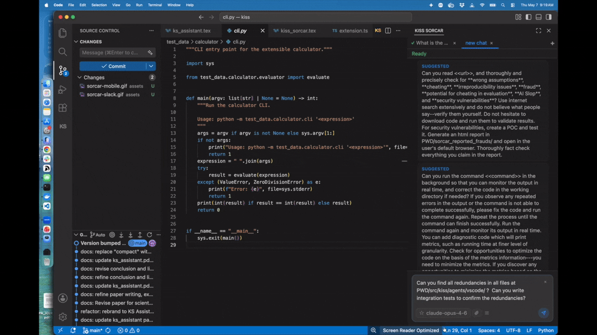

<div align="center">


[](https://pypi.org/project/kiss-agent-framework/)
[](LICENSE)
[](https://www.python.org/)
[](https://kisssorcar.github.io/)
[](https://arxiv.org/abs/2604.23822)

*"Everything should be made as simple as possible, but not simpler." — Albert Einstein*

</div>

# KISS Sorcar

### Open-source general-purpose AI agent for long-horizon tasks and AI discovery

**KISS Sorcar is a free, simple, local-first, bring-your-own-key AI agent framework.** It runs as a VS Code extension and a browser/mobile web app, both served by a local daemon, and offers a Python client API for scripting tasks. Your prompts and code are sent directly to the model provider or local endpoint you configure — not through our servers. It supports multi-model workflows just via prompts. Agents run as daemons hosted by the local server (a standalone `sorcar` terminal command can also run a task without the daemon). Complex AI systems/techniques can be replaced with a paragraph of prompt in KISS Sorcar.

```bash
curl -fsSL https://raw.githubusercontent.com/ksenxx/kiss_ai/main/scripts/install.sh | bash
```

______________________________________________________________________

<details>
<summary><strong>Table of Contents</strong></summary>

- [KISS Sorcar vs Claude Code vs Cursor](#kiss-sorcar-vs-claude-code-vs-cursor)
- [What is in the Name](#what-is-in-the-name)
- [Installation](#installation)
  - [Full install from source](#full-install-from-source)
  - [Python package install](#python-package-install)
  - [Configure model access](#configure-model-access)
  - [VS Code Extension Installation](#vs-code-extension-installation)
- [Using KISS Sorcar](#using-kiss-sorcar)
  - [VS Code extension and web/mobile app](#vs-code-extension-and-webmobile-app)
  - [The `kiss-web` daemon](#the-kiss-web-daemon)
  - [Python client API](#python-client-api)
  - [Sorcar Extension Agents (SEAs)](#sorcar-extension-agents-seas)
  - [Skills, MCP servers, and customization](#skills-mcp-servers-and-customization)
- [Messaging & Third-Party Agents](#messaging--third-party-agents)
- [Models Supported](#models-supported)
- [Contributing](#contributing)
- [License](#license)
- [Citation](#citation)

</details>

<div align="center">
  
</div>

## KISS Sorcar vs Claude Code vs Cursor

| Capability | **KISS Sorcar** | **Claude Code** | **Cursor** |
|---|---|---|---|
| **Interfaces** | VS Code extension + web/mobile app + Python API | CLI + mobile app | Custom VS Code |
| **AI Discovery** | ✅ simply via prompt | ❌ | ❌ |
| **GEPA Prompt Optimization** | ✅ simply via prompt | ❌ | ❌ |
| **Multiple models from multiple vendors in the same task** | ✅ Mix OpenAI, Anthropic, Gemini, Together, Z.AI, Moonshot AI, OpenRouter, Claude Code CLI, and Codex CLI | ❌ Anthropic Claude models only | ❌ One model per task |
| **Primary focus** | ✅ **Quality** — rigorous review, end-to-end tests | Speed and developer ergonomics | Speed |
| **Core Agents # LoC** | **~3000** | Unknown | Unknown |
| **Models in bundled catalog** | 688 across 9 provider categories | Claude family only | Subset chosen by Cursor |
| **Bring your own API key / endpoint** | ✅ Yes — keys stay on your machine | ✅ Anthropic key | ⚠️ Routed through Cursor backend |
| **Open source** | ✅ Apache-2.0 | ❌ Proprietary | ❌ Proprietary |
| **Price** | Free framework; pay only your chosen model provider | Subscription / API usage | Subscription |
| **Run on top of Claude Code / Codex CLI** | ✅ `cc/*` and `codex/*` namespaces | N/A | ❌ |
| **Messaging and communication channels** | ✅ 43 third-party agents: 32 messaging channels (Slack, Gmail, Email (IMAP/SMTP), Phone Control, SMS, WhatsApp, Home Assistant, …) plus service agents for GitHub, Notion, Postgres, Brave Search, Firecrawl, and Google Workspace | ⚠️ Slack, mobile Remote Control, and research-preview channels for Telegram, Discord, and iMessage; no documented built-in Gmail, WhatsApp, phone-call, or SMS channel | ⚠️ Slack and Microsoft Teams Cloud Agent integrations; no documented built-in Gmail, WhatsApp, phone-call, or SMS channel |
| **Scheduled automations** | ✅ natural-language cron agent | ❌ | ❌ |
| **Wake word for voice interaction** | Sorcar | N/A | N/A|

## What is in the Name

**KISS Agent Framework** is a deliberately small agent runtime organized around the [KISS principle](https://en.wikipedia.org/wiki/KISS_principle) ("Keep it Simple, Stupid").
The name “Sorcar” pays homage to [P. C. Sorcar](https://en.wikipedia.org/wiki/P._C._Sorcar), the legendary Bengali magician, evoking the idea of an agent that performs feats that appear magical yet are grounded in disciplined engineering.
Note: **Sorcar** also means government in Bengali.

## Installation

### Full install from source

```bash
curl -fsSL https://raw.githubusercontent.com/ksenxx/kiss_ai/main/scripts/install.sh | bash
```
When a new release is available, the update toast in the chat panel offers **Update** and **Update when idle**; once an idle update is armed it offers **Update now** and **Cancel** instead (the daemon installs the update as soon as no task is running; Cancel disarms it). When the daemon itself launches the installer (an idle update, or **Update** pressed in the web app), it refuses to start new tasks while the installer is starting and running; tasks already running are left alone, and the refusal is lifted as soon as the installer exits without restarting the daemon. **Update** pressed in VS Code runs the installer in an integrated terminal instead, guarded by the installer's own cross-process lock. If the Update button in the settings UI fails, run the full installation command again.  It will not delete your history.
The installer targets macOS and Linux on `x86_64`, `aarch64`, and `arm64`. It installs or checks the tools needed to run KISS Sorcar and build/install the VS Code extension.

**Branding.** The product name, tagline, and agent identity shown in the chat panel, the extension manifest, the system prompt, and the channel agents come from one file, `src/kiss/agents/vscode/media/brand.json` (`product_name`, `short_name`, `tagline`, `identity`, `extension_description`), read by the Python package (`kiss.core.brand`), the extension host (`src/brand.ts`), and the chat page. The `{{IDENTITY}}` placeholder in `src/kiss/SYSTEM.md`/`SYSTEM_LITE.md` and the `{{PRODUCT_NAME}}` placeholders in `src/kiss/TIPS.md` are filled from it, and `media/brand.css`, loaded after the stock stylesheet, is an empty skin hook. A white-label build puts its own copies of `brand.json`, `brand.css`, `kiss-icon.svg`, `kiss-icon.png`, and `thumbnail.jpeg` in a git-ignored `.brand/` directory at the checkout root: `install.sh` copies them over `media/` only for the extension build (`copy-kiss.sh` runs `scripts/apply-brand.js`, which rewrites the display strings in `package.json` from `brand.json`, and bundles the branded runtime; `npm run package` then builds the VSIX) and restores the checkout's own files afterwards, also when the build fails. Without `.brand/` nothing changes, and the checked-in files always carry the stock KISS Sorcar brand.

### Python package install

If you only want the Python package (the `kiss-web` daemon, the Python client API, and the messaging-agent entry points):

```bash
pipx install kiss-agent-framework
# or
uv tool install kiss-agent-framework
```

KISS Sorcar requires **Python 3.13+**.

### Configure model access

Provide at least one model backend. You can use environment variables such as:

```bash
export ANTHROPIC_API_KEY=...
export OPENAI_API_KEY=...
export ZAI_API_KEY=...
export MOONSHOT_API_KEY=...
export TOGETHER_API_KEY=...
export OPENROUTER_API_KEY=...
export GEMINI_API_KEY=...
```

You can also set API keys, a custom model endpoint, and custom HTTP headers in the Settings panel of the VS Code extension or web app.

You can register your own models (e.g. a local vLLM/Ollama endpoint or a provider model not in the bundled catalog) in the **Custom Models** section of the Settings panel; entries are stored in `~/.kiss/MY_MODELS.json` and appear in the model picker alongside the bundled catalog.

### VS Code Extension Installation

To install only the KISS Sorcar extension, open Visual Studio Code, search for **KISS Sorcar** in the extension marketplace, install it, and relaunch VS Code. Press ESC if you do not have a specific API key ready, but configure at least one model backend before running tasks.

## Using KISS Sorcar

KISS Sorcar has three client interfaces, all served by one local daemon: the **VS Code extension**, the **remote web/mobile app**, and the **Python client API**. A fourth interface, the **`sorcar` terminal command**, runs a SorcarAgent directly in the current directory without the daemon: `sorcar -t "Summarize README.md"` runs an inline task, `sorcar -f task.txt` runs the file's content as the task (exactly one of `-t`/`-f` is required; see `sorcar --help` for the model, budget, and work-dir flags).

### VS Code extension and web/mobile app

Open the KISS Sorcar sidebar in VS Code (or the remote web app in a browser) and type or speak your task. The chat interface provides:

- `@` file/folder mentions with ranked project-file completion.
- Per-task **git worktree isolation** — worktrees are pre-warmed in the background for fast task start, with auto-commit and merge on success, or an interactive merge/discard prompt — toggle both in the Settings panel. An auto-commit merge that hits conflicts is finished by the bundled merge agent (`src/kiss/agents/seas/merge_sea.py`) running as a sub-agent of the task, and a merge refused because another task is working directly in the main working tree is retried automatically once that task's changes are committed.
- A pre-run **task classifier** that detects whether the task may create or modify files in the project (code, docs, reports, presentations, data — anything that could become git-tracked) and so needs a worktree — tasks that write no files (questions, Internet answers given in the reply, git-only operations) skip worktree isolation, and simple tasks get a lite system prompt for faster starts. With an `OPENROUTER_API_KEY` it asks the `~typesafe/jev-latest` decisions model one typed question (about 0.2 s and $0.00003 per task; on a 415-prompt benchmark it matched hand labels more often than the LLM classifiers, see `benchmarkings/task_classifier/`); otherwise, or if that call fails, it falls back to one fast non-agentic call on the run's own model (structured output, with one plain-text retry if that fails; skipped for `cc/*` and `codex/*` models). Both are Settings-panel checkboxes: "Classify tasks before running" (`classify_tasks`) and "Classify with Jev" (`classify_with_decisions`; unticked pins the LLM classifier).
- A model picker, per-task budget caps, chat history with resume (filtered to the current workspace by default), an agent dashboard (burger menu, bottom-left), a **Working directory** panel in the "…" menu (type a path, pick a folder, or reopen one of the directories opened so far; in VS Code it only changes where the current chat's next task runs, the window keeps its folder), and inline rendering of tool-generated images in the chat panels. A question the agent asks with `ask_user_question` appears as a "Question" panel in the transcript and is answered from the composer.
- **Image and PDF attachments**: attach files to a task via the picker, paste, or drag-and-drop — images (HEIC/HEIF converted, oversized ones re-encoded) and PDFs are sent to the model along with the prompt.
- **Persistent agent memory** (on by default): standard Sorcar runs get seven `memory_*` tools (search, pull, read, write, list, refresh, delete) and a memory protocol, so agents recall lessons, preferences, and decisions across tasks (not for Docker runs, `cc/*`/`codex/*` models, runs that drop the built-in toolset, or runs whose `model_config` supplies its own `system_instruction`). Pages are Markdown files under `~/.kiss/memories` with a SQLite vector index (OpenAI embeddings when an `OPENAI_API_KEY` is available, otherwise a fully offline hashed embedder). Toggle it in the Settings panel or set `KISS_USE_MEMORY=0`; a custom directory goes in the `memory_dir` key of `~/.kiss/config.json`.
- Wake-word voice chat ("sorcar, …") via the mic button, including steering a running agent by voice.
- Live steering: inject a message into a running agent, or switch its model mid-run. Wrapping the message in `<task>…</task>` tags instead queues it as a follow-up task that runs sequentially after the current task finishes. A message typed while the task is already finishing (result broadcast, persistence, worktree merge) is run as the tab's next task with the same settings rather than dropped.
- Tab mirroring — every VS Code window and web client opened on the same workspace shows the same tabs with the same contents; the tab bar is scoped to the client's workspace directory, and sub-agents dispatched with `run_agent` open their own tab in the calling workspace.
- Scheduled automations: ask in plain language ("every weekday at 9am, summarize my unread Slack messages") and the built-in cron agent (also runnable from the shell as `kiss-cron`) creates, lists, pauses, resumes, or removes the schedule. A job runs an unattended LLM task or a plain shell command and can deliver its result to an authenticated messaging channel (25 of the 32 channels support delivery, e.g. `telegram:123456`, `email:user@example.com`). A job can name the directory it works in (`work_dir`); a prompt job bound to a Git repository can additionally run in a worktree with auto-commit like a chat task, and every job can override its timeout (10 minutes for commands, 1 hour for prompts by default). Sub-agents a prompt job spawns with `run_agent` or `run_parallel` inherit the rule never to ask questions or wait for approval.

The remote web app is the same interface served over a cloudflared tunnel: copy the URL and password from the Settings panel and open it on any device. Its desktop mode adds a docked **Task Info sidebar** next to the chat — live token, cost, step, elapsed-time, machine, work-dir, and budget metrics for the visible tab's running task, plus a **Task update**: a short report, written by the bundled `task_update` agent (`src/kiss/agents/seas/task_update_sea.py`), of what that task has done so far and its partial results. The agent runs when the panel first shows the task, every 10 minutes after that, and whenever you press the refresh button at the top right of the report; it runs as a sub-agent in the task's own chat and its cost counts towards the task.

### The `kiss-web` daemon

The `kiss-web` daemon hosts the agents, chat sessions, and the web app, and services every client command — including config reads/writes, default-model lookup, and the wake-word listener — over its socket. The VS Code extension starts it automatically; you can also manage it yourself:

```bash
# Start the daemon (serves the web app and the extension).
kiss-web

# Pin the daemon's working directory.
kiss-web --workdir "$HOME/projects/my-repo"

# Print the active remote (cloudflared) URL and exit.
kiss-web --url

# Trust the daemon's TLS certificate in this user's browsers and exit.
kiss-web --trust-ca
```

The web app is always served over HTTPS. The Cloudflare URL uses Cloudflare's certificate; the Local (`https://127.0.0.1:PORT`) and LAN (`https://<lan-ip>:PORT`) URLs use a certificate the daemon issues from a machine-local certificate authority kept in `~/.kiss/tls/` (`ca.pem`, `ca-key.pem`). Browsers warn about that certificate until they trust the CA, once per device:

- On the machine running the daemon: `kiss-web --trust-ca` adds `ca.pem` to the Chromium/Firefox NSS databases on Linux and the Firefox profiles on macOS (needs `certutil`: `libnss3-tools`/`nss-tools` on Linux, Homebrew's `nss` on macOS, found under `$HOMEBREW_PREFIX` or the default `/opt/homebrew` and `/usr/local` prefixes even though it is keg-only), the login keychain (macOS, for Safari and Chrome) and the user Root store (Windows). Restart the browser afterwards.
- On a phone or tablet on the same network: open `https://<lan-ip>:PORT/ca.crt`, install the downloaded certificate, then enable trust for it (iOS: Settings > General > About > Certificate Trust Settings; Android: Settings > Security > Encryption & credentials > Install a certificate > CA certificate). Compare the SHA-256 fingerprint printed by `kiss-web --trust-ca` with the one the device shows.

The CA certificate is public; the CA key never leaves `~/.kiss/tls/`. The server certificate is re-issued automatically when it is expiring or when the machine's LAN address changes, so the CA has to be trusted only once. The password gate and the LAN lockdown while no `remote_password` is set are unchanged.

### Python client API

Any Python process can run a task on the daemon with `kiss.server.sorcar.run` and block until it finishes (up to `timeout`, one hour by default):

```python
from kiss.server import sorcar

result = sorcar.run("Summarize README.md", work_dir="/path/to/repo")
print(result.text, result.success, result.cost, result.tokens, result.steps)

# Continue the same chat (the agent sees the prior task as context):
follow_up = sorcar.run("Now fix the typos you found", chat_id=result.chat_id)
```

`run()` accepts keyword options mirroring the chat interface — `model`, `work_dir`, `scope_work_dir` (workspace directory the task's tab is scoped to, when different from the execution `work_dir`), `chat_id`, `use_worktree`, `auto_commit`, `max_budget`, `model_config` (custom endpoint/headers), `use_web_tools`, `classify_tasks` (per-run task-classifier override; `None` falls back to the daemon's persisted setting), `use_memory` (per-run persistent-memory override — the `memory_*` tools plus the memory protocol; `None` falls back to the daemon process's non-empty `KISS_USE_MEMORY` environment variable, else its persisted setting), `is_parallel`, `tool_profile` (name of the tool profile the run's built-in toolset is cut down to — `"full"`, `"review"`, `"shell"`, or `"bash"`; empty keeps the full toolset), `docker_image` (run the task's shell and file tools inside a Docker container instead of on the daemon's host: an image name such as `"python:3.12"` starts a fresh container that is removed when the task ends, `container:<name-or-id>` attaches to a container you already run; background `Bash` jobs and persistent memory are unavailable in a Docker run; empty runs on the host), `timeout` (how long the client waits for the result — 3600 seconds by default, `None` waits indefinitely; on expiry the client raises `TimeoutError` while the daemon task keeps running), `stop_on_timeout` (also stop the task when `timeout` expires; default `False`), `sock_path` (daemon socket override), `parent_task_id` / `parent_tab_id` (attach the run as a sub-agent of a calling task, nesting its tab and history row under that task — how the `run_agent` tool dispatches), `parent_reviewer` (mark that sub-agent run as part of a reviewer's sub-tree so its own `run_parallel` refuses to spawn further reviewers; default `False`), `side_channel` (mark that sub-agent run as a side channel whose result is delivered into the parent's transcript, as `/ask` answers are, so its own nested tab is closed when the run ends; default `False`) — plus options to customize the agent itself:

- `tools="/path/to/my_tools.py"` — a Python file whose `get_tools()` function returns the functions the daemon registers as extra agent tools. The functions are never serialized: only the path travels over the socket, and the daemon imports the file, calls `get_tools()`, and runs the tools in its own process.
- `system_prompt` — replace the default system prompt for the run (and its sub-agents); `append_to_system_prompt` / `append_to_prompt` — append text to the system prompt or task prompt instead of replacing them.
- `append_basic_tools=False` — restrict the agent to `finish` plus your `tools` file, dropping the built-in toolset. The built-in toolset includes `Bash` — which with `background=True` starts the command detached and returns a job id — and `bash_job(job_id, action="wait" | "tail" | "kill")` to wait for, read, or stop such a job (not available in Docker runs).
- `extension_agent_path` — run a full Sorcar Extension Agent (SEA), a Python file that computes the run's parameters and tools on the daemon; see [Sorcar Extension Agents (SEAs)](#sorcar-extension-agents-seas) below.

### Sorcar Extension Agents (SEAs)

A **Sorcar Extension Agent (SEA)** is a plain Python file whose path you pass as `extension_agent_path` to `sorcar.run()`. The daemon imports the file on every run and calls its top-level `X()` functions — named after `run()`'s parameters — to compute the run's parameters; parameters without a getter keep whatever the caller passed. One file can define the task prompt, system prompt, model, budget, tools, and safety hooks — a complete custom agent:

```python
# weather_agent.py — a minimal SEA
import requests

def prompt() -> str:
    return "Look up the current weather in San Francisco and report it."

def max_budget() -> float:
    return 0.50

def use_worktree() -> bool:
    return False  # no repo changes expected

def if_append_basic_tools() -> bool:
    return False  # restrict the agent to finish + our tools

def system_prompt() -> str:
    return ("You are a weather assistant. Use the get_weather tool "
            "to look up weather, then call finish with the result.")

def get_weather(city: str) -> str:
    """Return current weather for a city from wttr.in.

    Args:
        city: City name to look up.
    """
    resp = requests.get(f"https://wttr.in/{city}?format=3", timeout=10)
    resp.raise_for_status()
    return resp.text.strip()

def tools() -> list:
    """Return the tools the agent may call."""
    return [get_weather]
```

```python
from kiss.server import sorcar

result = sorcar.run(
    "placeholder",  # required non-blank; overridden by prompt()
    extension_agent_path="weather_agent.py",
)
```

Key points:

- **Overridable parameters.** Every `sorcar.run()` parameter except `timeout`, `stop_on_timeout`, `sock_path`, `parent_task_id`, `parent_tab_id`, `parent_reviewer`, `side_channel`, and `extension_agent_path` itself has a getter named after it: `prompt()`, `work_dir()`, `model()`, `chat_id()`, `system_prompt()`, `tools()`, `use_worktree()`, `auto_commit()`, `max_budget()`, `model_config()`, `if_append_basic_tools()` (overrides `append_basic_tools`), `append_to_system_prompt()`, `append_to_prompt()`, `scope_work_dir()`, `use_web_tools()`, `classify_tasks()`, `use_memory()`, `is_parallel()`, `tool_profile()`, and `docker_image()`. `use_web_tools()`, `classify_tasks()`, and `use_memory()` return a bool, or `None` to fall back to the daemon's default (the persisted setting — for `use_memory()` a non-empty `KISS_USE_MEMORY` environment variable on the daemon process wins over the stored value). `tool_profile()` returns the name of the tool profile the run's built-in toolset is cut down to — `"full"`, `"review"`, `"shell"`, or `"bash"` (Bash only; the bundled `/sh` agent uses it) — or `""` for the daemon's usual choice. `docker_image()` returns the Docker image the run's shell and file tools execute in, `container:<name-or-id>` to attach to a running container, or `""` for the host.
- **Atomic, type-checked overrides.** Getters run in the daemon process and are re-imported from source on every run. Each return value is type-checked; overrides apply only after every getter succeeds, and a broken getter fails the task with a diagnostic in `TaskResult.text`.
- **Tools, two ways.** `tools()` may return a list of callables — making the script its own tools file — or the path of a separate Python file whose `get_tools()` (or `tools()`) returns the callables. Either way the tools execute in the daemon process; nothing is serialized over the socket. `tools()` overrides (does not append to) the caller's `tools` argument.
- **Hook getters.** `llm_call_hook()` and `tool_call_hook()` return functions with no `run()` equivalent (callables can't travel the wire). `llm_call_hook(new_messages)` runs before every LLM call and its return value replaces the outgoing messages; `tool_call_hook(name, args)` runs before every tool call — returning `"OK"` lets the tool execute, any other string suppresses the call and is given to the model as the tool's result:

```python
# guarded_agent.py — veto dangerous shell commands
def veto_destructive(name, args):
    if name == "Bash" and "rm -rf" in str(args.get("command", "")):
        return "Blocked: destructive command"
    return "OK"

def tool_call_hook():
    return veto_destructive
```

The full authoring guide — every getter's semantics, error handling, chat continuation, model configuration, and a complete worked example — is in [src/kiss/server/README.md](src/kiss/server/README.md).

**Slash commands.** Name the file `xxx_sea.py` and it is also a chat command: typing `/xxx some text` in the VS Code extension or web app makes the session call `run_agent` with that file and "some text" as the task. The bundled channel agents are registered this way (`/slack`, `/gmail`, ...), as is `/ask <question>`, which answers a question about the current task from its persisted events in `~/.kiss/sorcar.db`; typed into a running task's tab it runs as a nested sub-agent without interrupting the agent, and the reply appears as an "Answer" panel in the transcript. The bundled SEAs in `src/kiss/agents/seas/` are commands too, among them `/sh <command>` (runs the command with the `Bash` tool alone, directly in the tab's working directory, and returns its raw output), `/merge <instructions>` (resolves and stages the conflicted files of an in-progress git merge, committing only when the instructions ask for it — the same agent the auto-commit worktree merge runs on its own when the merge conflicts), `/task_update <task_id>` (reports what that task has done so far and its partial results), `/skillopt <instructions>` (optimizes the prompt text of a skill, an SEA's `system_prompt()` constant, or any module-level string constant against an evaluation set and writes the accepted text next to the target as `<target>.proposed`; also runnable as `python -m kiss.agents.seas.skillopt_sea`), and `/write_paper <instructions>` (writes or revises a research paper under the rules of `templates/write_paper_prompt.md`: the instructions name the venue, the `.tex` path, the topic, the sources of truth and the reviewer model; the agent gets a `check_paper` tool that runs the template's AI-slop and consistency gates on the prose with line numbers, and a `build_paper` tool that runs pdflatex/bibtex and summarizes errors, undefined references and overfull boxes), and `/review_paper <instructions>` (reviews a paper, a PDF, `.tex`, `.md` or `.txt` file, for any venue: the instructions name the paper, the venue, the output path, the word limit and the cutoff date for related work; the agent reads the paper page by page with a `read_paper` tool, searches the related work, judges the novelty, pinpoints problems by page and table with a fix for each, and runs a `check_review` tool that checks the review's structure, word limit and AI-slop gates with line numbers). List your own SEA folders, one per line, in `~/.kiss/SEAS.md`; they are picked up within two seconds, no restart needed. Syntax, precedence, and the dispatch flow are documented in [docs/sea-commands.md](https://kisssorcar.github.io/docs/sea-commands.md).

### Skills, MCP servers, and customization

- Agent Skills loaded from `~/.kiss/skills`, `<project>/.kiss/skills`, Claude skill directories, `.agents/skills`, and bundled Sorcar skills.
- MCP server discovery from `~/.kiss/mcp.json`, `<project>/.kiss/mcp.json`, and `<project>/.mcp.json`; OAuth tokens are persisted under `~/.kiss/mcp_auth/`. A curated catalog of privacy-first MCP connectors (fetch, time, memory, GitHub, Slack, Google Workspace, WhatsApp, …) ships in [connectors/](connectors/README.md) with `enable.py`/`verify.py` CLIs.
- "Tricks" (inject-instruction) entries are the concatenation of two `## Trick`-sectioned Markdown files: (1) `~/.kiss/MY_INJECTION.md` — your personal tricks, auto-created on first read with a starter trick and never overwritten thereafter; (2) the bundled `src/kiss/INJECTIONS.md`, read directly from the package so every upgrade delivers the latest bundled tricks. Edit `~/.kiss/MY_INJECTION.md` to customise; your tricks are listed first.
- Welcome-screen sample-task chips are the concatenation of two `## Task`-sectioned Markdown files: (1) `~/.kiss/MY_TASK_TEMPLATES.md` — your personal tasks, auto-created on first launch with the seed `## Task\n\nHi!\n` and never overwritten thereafter; (2) the bundled `src/kiss/SAMPLE_TASKS.md` — sample tasks shipped with the extension, read directly from the package so every upgrade delivers the latest chips. To customise your chips edit `~/.kiss/MY_TASK_TEMPLATES.md`; to reset it remove the file.

## Messaging & Third-Party Agents

KISS Sorcar includes 43 third-party agents that act on messaging services, mailboxes, devices, and web services on your behalf. 32 are messaging-channel agents:

BlueBubbles · DingTalk · Discord · Email (IMAP/SMTP) · Feishu · Gmail · Google Chat · Home Assistant · iMessage · IRC · LINE · Matrix · Mattermost · Microsoft Teams · Nextcloud Talk · Nostr · ntfy · Phone Control · QQ · Signal · SimpleX · Slack · SMS · Synology Chat · Telegram · Tlon · Twitch · Webhook · WeCom · WeiXin · WhatsApp · Zalo

Nine more are service agents that give Sorcar authenticated API tools for productivity and data services:

Brave Search (`kiss-brave`) · Firecrawl (`kiss-firecrawl`) · GitHub (`kiss-github`) · Google Calendar (`kiss-gcal`) · Google Docs (`kiss-gdocs`) · Google Drive (`kiss-gdrive`) · Google Sheets (`kiss-gsheets`) · Notion (`kiss-notion`) · PostgreSQL (`kiss-postgres`)

In a chat task, just say what you want ("send 'running late' to Alice on WhatsApp", "list my open GitHub PRs") — Sorcar dispatches the matching agent through its `run_agent` tool. Besides the task and the optional agent name (empty runs a plain Sorcar sub-session through the bundled `src/kiss/agents/seas/dummy_sea.py`), the tool takes a `workspace` (account identifier for multi-account channels such as Slack; default `"default"`) and the same optional per-run options as `sorcar.run()` — `model_name`, `max_budget`, `timeout`, `chat_id`, `system_prompt`, `tools`, `model_config`, `use_worktree`, `auto_commit`, `use_web_tools`, `classify_tasks`, `use_memory`, `is_parallel`, `append_basic_tools`, `append_to_system_prompt`, `append_to_prompt`, `tool_profile` — as strings (`"true"`/`"false"` for booleans, a JSON object for `model_config`); an empty value keeps the default. Channel and cron sub-tasks always run without a worktree or auto-commit. Each agent also has its own CLI entry point (`kiss-slack`, `kiss-gmail`, `kiss-whatsapp`, …) for running tasks directly from the shell.

Channels also work **inbound**: gateway-capable messaging channels can become prompt surfaces of their own. A one-shot `--channel` poll tick (normally scheduled as a recurring cron job — just ask for "an always-on Telegram gateway" in chat) drains new inbound messages and runs each as a Sorcar task, with persisted thread continuity across ticks, a delivery ledger, per-channel model/budget overrides, sender allow-lists (`--allow-users`), and an optional pairing handshake (`--pairing`, `--approve`, `--list-pending`) so only approved senders can drive the agent.

Two infrastructure agents round out the set: an **A2A agent** (`kiss-a2a`) exposing Sorcar over the agent-to-agent protocol, and an **OpenAI-compatible server** (`kiss-oai`) that serves Sorcar behind an OpenAI-style HTTP API. It also ships a **Govee smart-home CLI** for controlling IoT lights (on/off, brightness, color, and color temperature) via the Govee Developer API.

**Credential isolation (Muse auth).** On Linux, credentials for the 24 Muse-supported connectors (the six Google services — Google Chat's service-account mode excepted — plus Slack, GitHub, Notion, Discord, Home Assistant, Firecrawl, Brave Search, ntfy, Govee, LINE, Mattermost, Nextcloud Talk, Synology Chat, Twitch, Zalo, BlueBubbles, Microsoft Teams, and Telegram) are isolated by default behind a Meta-Muse-style security boundary: legacy tokens auto-migrate into a vault owned by a local auth daemon on first use (a one-time hand-off of the real credential; plaintext copies are then scrubbed on a best-effort basis), the agent process holds only opaque surrogate tokens that the daemon swaps for the real ones at the network edge, and every boundary-routed API request is host-allowlisted (credential-free, bodyless `GET`/`HEAD` redirect hops are the one permitted off-list exception), classified read vs. write, and checked against an allow/deny/ask policy with an audit log. Reads are allowed by default; writes ask for a grant. For Microsoft Teams, after the one-time enrollment hand-off, the daemon performs the OAuth token exchange itself, keeping the vaulted client secret out of ordinary agent API requests. Where the provider supports a poll-based grant, connecting works like the Muse app's Connect button — the user signs in and approves in their own browser, nothing is pasted back: GitHub, Twitch, and Microsoft Teams use the OAuth device authorization grant (RFC 8628) with a public client ID, Nextcloud Talk uses Login Flow v2, Matrix uses the OAuth 2.0 device grant of homeservers backed by Matrix Authentication Service (matrix.org included), and Signal links this computer like Signal Desktop via a `signal-cli link` QR code; the refresh tokens these sign-ins produce are renewed by the daemon (`oauth2_refresh_token` credentials) or, for Matrix, by the agent itself. Providers without such a grant get a safe hand-off instead of browser automation: the sign-in, consent, or developer-portal page is opened in the user's default browser when the machine has one, and its URL is always shown in the chat as well, so the user can open it themselves if no browser window appeared; on a headless host the six Google services return the consent URL for the user to approve in their own browser and paste back the resulting `localhost` redirect URL, and Slack/Discord ask the user to create the bot in their own browser and paste back the bot token — the agent never asks for a password or 2FA code. Manage it with `python -m kiss.agents.third_party_agents.muse_auth` (`status`, `enroll`, `import`, `grant`, `revoke`, `audit`, `clear`, `daemon`, `stop`, and an `export` command that reads a vaulted credential back out for recovery); opt out with `KISS_MUSE_AUTH=0`.

These agents live in `src/kiss/agents/third_party_agents/`; a prompt-oriented usage guide with a complete agent catalog and 26 worked examples is in [src/kiss/agents/third_party_agents/README.md](src/kiss/agents/third_party_agents/README.md).

## Models Supported

KISS Sorcar ships a catalog of **688 models** across **9 provider categories**, with built-in prices, context lengths, and capability flags (`fc` function calling, `gen` generation, `emb` embedding, `dec` typed decisions via OpenRouter's `/api/alpha/decisions`). The source of truth is [src/kiss/core/models/MODEL_INFO.json](src/kiss/core/models/MODEL_INFO.json). Cost and budget tracking use these prices, except for `openrouter/*` models, where the cost OpenRouter reports for each response (`usage.cost`, plus the upstream provider's charge under BYOK) is billed instead of the catalog estimate, since the same model id is priced differently per upstream route. Models are grouped below by the provider that routes them (i.e., whose API key or CLI serves the model); open-weight `openai/gpt-oss-*` and `google/gemma-*` models are served via Together AI.

| Provider category | Catalog entries |
|---|---:|
| OpenAI | 106 |
| Anthropic | 15 |
| Gemini | 20 |
| Together AI | 103 |
| Z.AI | 8 |
| Moonshot AI | 10 |
| OpenRouter | 401 |
| Claude Code CLI (`cc/*`) | 15 |
| Codex CLI (`codex/*`) | 10 |

Current catalog capability totals:

- **670** generation-capable models
- **504** function-calling-capable models
- **7** embedding models
- **2** decision models

Full model list:

<details>
<summary><strong>OpenAI (106)</strong></summary>

- `gpt-3.5-turbo`
- `gpt-3.5-turbo-0125`
- `gpt-3.5-turbo-1106`
- `gpt-3.5-turbo-16k`
- `gpt-4`
- `gpt-4-0613`
- `gpt-4-turbo`
- `gpt-4-turbo-2024-04-09`
- `gpt-4.1`
- `gpt-4.1-2025-04-14`
- `gpt-4.1-mini`
- `gpt-4.1-mini-2025-04-14`
- `gpt-4.1-nano`
- `gpt-4.1-nano-2025-04-14`
- `gpt-4o`
- `gpt-4o-2024-05-13`
- `gpt-4o-2024-08-06`
- `gpt-4o-2024-11-20`
- `gpt-4o-mini`
- `gpt-4o-mini-2024-07-18`
- `gpt-4o-mini-search-preview`
- `gpt-4o-mini-search-preview-2025-03-11`
- `gpt-4o-search-preview`
- `gpt-4o-search-preview-2025-03-11`
- `gpt-5`
- `gpt-5-2025-08-07`
- `gpt-5-chat-latest`
- `gpt-5-mini`
- `gpt-5-mini-2025-08-07`
- `gpt-5-nano`
- `gpt-5-nano-2025-08-07`
- `gpt-5.1`
- `gpt-5.1-2025-11-13`
- `gpt-5.1-chat-latest`
- `gpt-5.2`
- `gpt-5.2-2025-12-11`
- `gpt-5.2-chat-latest`
- `gpt-5.3-chat-latest`
- `gpt-5.4`
- `gpt-5.4-2026-03-05`
- `gpt-5.4-mini`
- `gpt-5.4-mini-2026-03-17`
- `gpt-5.4-nano`
- `gpt-5.4-nano-2026-03-17`
- `gpt-5.5`
- `gpt-5.5-2026-04-23`
- `gpt-5.5-2026-04-23-high`
- `gpt-5.5-2026-04-23-low`
- `gpt-5.5-2026-04-23-medium`
- `gpt-5.5-2026-04-23-xhigh`
- `gpt-5.5-high`
- `gpt-5.5-low`
- `gpt-5.5-medium`
- `gpt-5.5-xhigh`
- `gpt-5.6-luna`
- `gpt-5.6-luna-high`
- `gpt-5.6-luna-low`
- `gpt-5.6-luna-medium`
- `gpt-5.6-luna-xhigh`
- `gpt-5.6-sol`
- `gpt-5.6-sol-high`
- `gpt-5.6-sol-low`
- `gpt-5.6-sol-medium`
- `gpt-5.6-sol-xhigh`
- `gpt-5.6-terra`
- `gpt-5.6-terra-high`
- `gpt-5.6-terra-low`
- `gpt-5.6-terra-medium`
- `gpt-5.6-terra-xhigh`
- `gpt-6-astra`
- `gpt-6-astra-high`
- `gpt-6-astra-low`
- `gpt-6-astra-medium`
- `gpt-6-astra-xhigh`
- `gpt-6-luna`
- `gpt-6-luna-high`
- `gpt-6-luna-low`
- `gpt-6-luna-medium`
- `gpt-6-luna-xhigh`
- `gpt-6-sol`
- `gpt-6-sol-high`
- `gpt-6-sol-low`
- `gpt-6-sol-medium`
- `gpt-6-sol-xhigh`
- `gpt-audio`
- `gpt-audio-1.5`
- `gpt-audio-2025-08-28`
- `gpt-audio-mini`
- `gpt-audio-mini-2025-10-06`
- `gpt-audio-mini-2025-12-15`
- `gpt-image-1`
- `gpt-image-1-mini`
- `gpt-image-1.5`
- `gpt-image-2`
- `gpt-image-2-2026-04-21`
- `o1`
- `o1-2024-12-17`
- `o3`
- `o3-2025-04-16`
- `o3-mini`
- `o3-mini-2025-01-31`
- `o4-mini`
- `o4-mini-2025-04-16`
- `text-embedding-3-large`
- `text-embedding-3-small`
- `text-embedding-ada-002`

</details>

<details>
<summary><strong>Anthropic (15)</strong></summary>

- `claude-fable-5`
- `claude-fable-5-1`
- `claude-haiku-4-5`
- `claude-haiku-4-5-20251001`
- `claude-opus-4-5`
- `claude-opus-4-5-20251101`
- `claude-opus-4-6`
- `claude-opus-4-7`
- `claude-opus-4-8`
- `claude-opus-5`
- `claude-opus-5-5`
- `claude-sonnet-4-5`
- `claude-sonnet-4-5-20250929`
- `claude-sonnet-4-6`
- `claude-sonnet-5`

</details>

<details>
<summary><strong>Gemini (20)</strong></summary>

- `gemini-2.5-flash`
- `gemini-2.5-flash-image`
- `gemini-2.5-flash-lite`
- `gemini-2.5-pro`
- `gemini-3-flash-preview`
- `gemini-3-pro-image`
- `gemini-3.1-flash-image`
- `gemini-3.1-flash-lite`
- `gemini-3.1-flash-lite-image`
- `gemini-3.1-flash-lite-preview`
- `gemini-3.1-flash-tts-preview`
- `gemini-3.1-pro-preview`
- `gemini-3.5-flash`
- `gemini-3.5-flash-lite`
- `gemini-3.6-flash`
- `gemini-3.7-flash`
- `gemini-3.8-flash`
- `gemini-embedding-001`
- `gemini-embedding-2`
- `gemini-embedding-2-preview`

</details>

<details>
<summary><strong>Together AI (103)</strong></summary>

- `BAAI/bge-base-en-v1.5`
- `Qwen/QwQ-32B`
- `Qwen/Qwen2-1.5B-Instruct`
- `Qwen/Qwen2-VL-72B-Instruct`
- `Qwen/Qwen2.5-14B-Instruct`
- `Qwen/Qwen2.5-72B-Instruct`
- `Qwen/Qwen2.5-72B-Instruct-Turbo`
- `Qwen/Qwen2.5-7B-Instruct-Turbo`
- `Qwen/Qwen2.5-Coder-32B-Instruct`
- `Qwen/Qwen2.5-VL-72B-Instruct`
- `Qwen/Qwen3-235B-A22B-Instruct-2507-tput`
- `Qwen/Qwen3-235B-A22B-Thinking-2507`
- `Qwen/Qwen3-Coder-480B-A35B-Instruct-FP8`
- `Qwen/Qwen3-Coder-Next-FP8`
- `Qwen/Qwen3-Next-80B-A3B-Instruct`
- `Qwen/Qwen3-Next-80B-A3B-Thinking`
- `Qwen/Qwen3-VL-32B-Instruct`
- `Qwen/Qwen3-VL-8B-Instruct`
- `Qwen/Qwen3.5-397B-A17B`
- `Qwen/Qwen3.5-9B`
- `Qwen/Qwen3.6-Plus`
- `Qwen/Qwen3.7-Max`
- `Qwen/Qwen3.7-Plus`
- `Qwen/Qwen3.8-2.4T-A95B`
- `Qwen/Qwen3.8-Flash`
- `arcee-ai/trinity-mini`
- `deepcogito/cogito-v1-preview-llama-70B`
- `deepcogito/cogito-v1-preview-llama-70B-Turbo`
- `deepcogito/cogito-v1-preview-llama-8B`
- `deepcogito/cogito-v1-preview-qwen-14B`
- `deepcogito/cogito-v1-preview-qwen-32B`
- `deepcogito/cogito-v2-1-671b`
- `deepseek-ai/DeepSeek-R1`
- `deepseek-ai/DeepSeek-R1-0528`
- `deepseek-ai/DeepSeek-R1-0528-tput`
- `deepseek-ai/DeepSeek-R1-Distill-Llama-70B`
- `deepseek-ai/DeepSeek-R1-Distill-Qwen-1.5B`
- `deepseek-ai/DeepSeek-R1-Distill-Qwen-14B`
- `deepseek-ai/DeepSeek-V3-0324`
- `deepseek-ai/DeepSeek-V3.1`
- `deepseek-ai/DeepSeek-V4-Flash-0731`
- `deepseek-ai/DeepSeek-V4-Pro`
- `deepseek-ai/DeepSeek-V4-Pro-0813`
- `deepseek-ai/DeepSeek-V4.1-Flash`
- `deepseek-ai/deepseek-coder-33b-instruct`
- `essentialai/rnj-1-instruct`
- `google/gemma-2-27b-it`
- `google/gemma-3n-E4B-it`
- `google/gemma-4-31B-it`
- `intfloat/multilingual-e5-large-instruct`
- `meta-llama/Llama-3-70b-chat-hf`
- `meta-llama/Llama-3-8b-chat-hf`
- `meta-llama/Llama-3.1-405B-Instruct`
- `meta-llama/Llama-3.2-1B-Instruct`
- `meta-llama/Llama-3.2-3B-Instruct-Turbo`
- `meta-llama/Llama-3.3-70B-Instruct-Turbo`
- `meta-llama/Llama-3.3-70B-Instruct-Turbo-test`
- `meta-llama/Llama-4-Maverick-17B-128E-Instruct-FP8`
- `meta-llama/Llama-4-Scout-17B-16E-Instruct`
- `meta-llama/Meta-Llama-3-70B-Instruct-Turbo`
- `meta-llama/Meta-Llama-3-8B-Instruct`
- `meta-llama/Meta-Llama-3-8B-Instruct-Lite`
- `meta-llama/Meta-Llama-3.1-70B-Instruct-Reference`
- `meta-llama/Meta-Llama-3.1-70B-Instruct-Turbo`
- `meta-llama/Meta-Llama-3.1-8B-Instruct-Reference`
- `meta-llama/Meta-Llama-3.1-8B-Instruct-Turbo`
- `mistralai/Ministral-3-14B-Instruct-2512`
- `mistralai/Mistral-7B-Instruct-v0.1`
- `mistralai/Mistral-7B-Instruct-v0.2`
- `mistralai/Mistral-7B-Instruct-v0.3`
- `mistralai/Mistral-Small-24B-Instruct-2501`
- `mistralai/Mixtral-8x7B-Instruct-v0.1`
- `moonshotai/Kimi-K2-Instruct`
- `moonshotai/Kimi-K2-Instruct-0905`
- `moonshotai/Kimi-K2-Thinking`
- `moonshotai/Kimi-K2.5`
- `moonshotai/Kimi-K2.6`
- `moonshotai/Kimi-K2.7-Code`
- `moonshotai/Kimi-K3`
- `moonshotai/Kimi-K3-high`
- `moonshotai/Kimi-K3-low`
- `moonshotai/Kimi-K3-max`
- `nvidia/Llama-3.1-Nemotron-70B-Instruct-HF`
- `nvidia/NVIDIA-Nemotron-Nano-9B-v2`
- `nvidia/nemotron-3-ultra-550b-a55b`
- `openai/gpt-oss-120b`
- `openai/gpt-oss-120b-high`
- `openai/gpt-oss-120b-low`
- `openai/gpt-oss-120b-medium`
- `openai/gpt-oss-20b`
- `openai/gpt-oss-20b-high`
- `openai/gpt-oss-20b-low`
- `openai/gpt-oss-20b-medium`
- `zai-org/GLM-4.5-Air-FP8`
- `zai-org/GLM-4.6`
- `zai-org/GLM-4.7`
- `zai-org/GLM-5`
- `zai-org/GLM-5.1`
- `zai-org/GLM-5.2`
- `zai-org/GLM-5.2-high`
- `zai-org/GLM-5.2-max`
- `zai-org/GLM-5.3`
- `zai-org/GLM-5.3-Flash`

</details>

<details>
<summary><strong>Z.AI (8)</strong></summary>

- `glm-4-32b-0414-128k`
- `glm-4.5`
- `glm-4.5-air`
- `glm-4.5-airx`
- `glm-4.5-flash`
- `glm-4.5-x`
- `glm-4.6`
- `glm-4.7`

</details>

<details>
<summary><strong>Moonshot AI (10)</strong></summary>

- `kimi-k2.5`
- `kimi-k2.6`
- `kimi-k2.7-code`
- `kimi-k3`
- `kimi-k3-high`
- `kimi-k3-low`
- `kimi-k3-max`
- `moonshot-v1-128k`
- `moonshot-v1-32k`
- `moonshot-v1-8k`

</details>

<details>
<summary><strong>OpenRouter (401)</strong></summary>

- `openrouter/aion-labs/aion-2.0`
- `openrouter/aion-labs/aion-3.0`
- `openrouter/aion-labs/aion-3.0-mini`
- `openrouter/aion-labs/aion-3.5`
- `openrouter/aion-labs/aion-3.5-mini`
- `openrouter/aion-labs/aion-rp-llama-3.1-8b`
- `openrouter/amazon/nova-2-lite-v1`
- `openrouter/amazon/nova-lite-v1`
- `openrouter/amazon/nova-micro-v1`
- `openrouter/amazon/nova-premier-v1`
- `openrouter/amazon/nova-pro-v1`
- `openrouter/anthracite-org/magnum-v4-72b`
- `openrouter/anthropic/claude-3-haiku`
- `openrouter/anthropic/claude-3.7-sonnet:thinking`
- `openrouter/anthropic/claude-fable-5`
- `openrouter/anthropic/claude-fable-5.1`
- `openrouter/anthropic/claude-haiku-4.5`
- `openrouter/anthropic/claude-opus-4.1`
- `openrouter/anthropic/claude-opus-4.5`
- `openrouter/anthropic/claude-opus-4.6`
- `openrouter/anthropic/claude-opus-4.7`
- `openrouter/anthropic/claude-opus-4.8`
- `openrouter/anthropic/claude-opus-5`
- `openrouter/anthropic/claude-opus-5.5`
- `openrouter/anthropic/claude-sonnet-4`
- `openrouter/anthropic/claude-sonnet-4.5`
- `openrouter/anthropic/claude-sonnet-4.6`
- `openrouter/anthropic/claude-sonnet-5`
- `openrouter/arcee-ai/trinity-large-thinking`
- `openrouter/baidu/ernie-4.5-vl-424b-a47b`
- `openrouter/bytedance-seed/seed-1.6`
- `openrouter/bytedance-seed/seed-1.6-flash`
- `openrouter/bytedance-seed/seed-2-1-turbo`
- `openrouter/bytedance-seed/seed-2.0-code`
- `openrouter/bytedance-seed/seed-2.0-lite`
- `openrouter/bytedance-seed/seed-2.0-mini`
- `openrouter/bytedance/ui-tars-1.5-7b`
- `openrouter/cognitivecomputations/dolphin-mistral-24b-venice-edition`
- `openrouter/cohere/command-a`
- `openrouter/cohere/command-r-08-2024`
- `openrouter/cohere/command-r-plus-08-2024`
- `openrouter/cohere/command-r7b-12-2024`
- `openrouter/deepseek/deepseek-chat`
- `openrouter/deepseek/deepseek-chat-v3-0324`
- `openrouter/deepseek/deepseek-chat-v3.1`
- `openrouter/deepseek/deepseek-r1`
- `openrouter/deepseek/deepseek-r1-0528`
- `openrouter/deepseek/deepseek-r1-distill-llama-70b`
- `openrouter/deepseek/deepseek-v3.1-terminus`
- `openrouter/deepseek/deepseek-v3.2`
- `openrouter/deepseek/deepseek-v3.2-exp`
- `openrouter/deepseek/deepseek-v4-flash`
- `openrouter/deepseek/deepseek-v4-flash-0731`
- `openrouter/deepseek/deepseek-v4-flash-vision-exp`
- `openrouter/deepseek/deepseek-v4-pro`
- `openrouter/deepseek/deepseek-v4-pro-0813`
- `openrouter/deepseek/deepseek-v4.1-flash`
- `openrouter/fireworks/ember-1`
- `openrouter/google/gemini-2.5-flash`
- `openrouter/google/gemini-2.5-flash-image`
- `openrouter/google/gemini-2.5-flash-lite`
- `openrouter/google/gemini-2.5-pro`
- `openrouter/google/gemini-2.5-pro-preview`
- `openrouter/google/gemini-3-flash-preview`
- `openrouter/google/gemini-3-pro-image`
- `openrouter/google/gemini-3-pro-image-preview`
- `openrouter/google/gemini-3.1-flash-image`
- `openrouter/google/gemini-3.1-flash-image-preview`
- `openrouter/google/gemini-3.1-flash-lite`
- `openrouter/google/gemini-3.1-flash-lite-image`
- `openrouter/google/gemini-3.1-flash-lite-preview`
- `openrouter/google/gemini-3.1-pro-preview`
- `openrouter/google/gemini-3.1-pro-preview-customtools`
- `openrouter/google/gemini-3.5-flash`
- `openrouter/google/gemini-3.5-flash-lite`
- `openrouter/google/gemini-3.6-flash`
- `openrouter/google/gemini-3.7-flash`
- `openrouter/google/gemini-3.8-flash`
- `openrouter/google/gemma-2-27b-it`
- `openrouter/google/gemma-3-12b-it`
- `openrouter/google/gemma-3-27b-it`
- `openrouter/google/gemma-3-4b-it`
- `openrouter/google/gemma-4-26b-a4b-it`
- `openrouter/google/gemma-4-31b-it`
- `openrouter/google/lyria-3-clip-preview`
- `openrouter/google/lyria-3-pro-preview`
- `openrouter/gryphe/mythomax-l2-13b`
- `openrouter/ibm-granite/granite-4.0-h-micro`
- `openrouter/ibm-granite/granite-4.2-8b`
- `openrouter/inception/mercury-2`
- `openrouter/inception/mercury-2.5`
- `openrouter/inclusionai/ling-3.0-flash`
- `openrouter/inclusionai/ling-3.0-flash-fin`
- `openrouter/inclusionai/ling-3.0-flash-vl`
- `openrouter/inference-net/schematron-v2-small`
- `openrouter/inference-net/schematron-v2-turbo`
- `openrouter/kwaipilot/kat-coder-pro-v2.5`
- `openrouter/mancer/weaver`
- `openrouter/meituan/longcat-2.0`
- `openrouter/meta-llama/llama-3.1-70b-instruct`
- `openrouter/meta-llama/llama-3.1-8b-instruct`
- `openrouter/meta-llama/llama-3.2-1b-instruct`
- `openrouter/meta-llama/llama-3.2-3b-instruct`
- `openrouter/meta-llama/llama-3.3-70b-instruct`
- `openrouter/meta-llama/llama-4-maverick`
- `openrouter/meta-llama/llama-4-scout`
- `openrouter/meta-llama/llama-guard-4-12b`
- `openrouter/meta/muse-glimmer-30b`
- `openrouter/meta/muse-spark-1.1`
- `openrouter/meta/muse-spark-1.2`
- `openrouter/meta/muse-spark-1.3`
- `openrouter/microsoft/phi-4`
- `openrouter/microsoft/wizardlm-2-8x22b`
- `openrouter/mistralai/codestral-2508`
- `openrouter/mistralai/ministral-14b-2512`
- `openrouter/mistralai/ministral-3b-2512`
- `openrouter/mistralai/ministral-8b-2512`
- `openrouter/mistralai/mistral-large`
- `openrouter/mistralai/mistral-large-2407`
- `openrouter/mistralai/mistral-medium-3`
- `openrouter/mistralai/mistral-medium-3-5`
- `openrouter/mistralai/mistral-medium-3.1`
- `openrouter/mistralai/mistral-nemo`
- `openrouter/mistralai/mistral-saba`
- `openrouter/mistralai/mistral-small-24b-instruct-2501`
- `openrouter/mistralai/mistral-small-2603`
- `openrouter/mistralai/mistral-small-3.1-24b-instruct`
- `openrouter/mistralai/mistral-small-3.2-24b-instruct`
- `openrouter/mistralai/mixtral-8x22b-instruct`
- `openrouter/mistralai/voxtral-small-24b-2507`
- `openrouter/moonshotai/kimi-k2`
- `openrouter/moonshotai/kimi-k2-0905`
- `openrouter/moonshotai/kimi-k2-thinking`
- `openrouter/moonshotai/kimi-k2.5`
- `openrouter/moonshotai/kimi-k2.6`
- `openrouter/moonshotai/kimi-k2.7-code`
- `openrouter/moonshotai/kimi-k3`
- `openrouter/moonshotai/kimi-k3-high`
- `openrouter/moonshotai/kimi-k3-low`
- `openrouter/moonshotai/kimi-k3-max`
- `openrouter/morph/morph-v3-fast`
- `openrouter/morph/morph-v3-large`
- `openrouter/nousresearch/hermes-3-llama-3.1-405b`
- `openrouter/nousresearch/hermes-3-llama-3.1-70b`
- `openrouter/nousresearch/hermes-4-405b`
- `openrouter/nvidia/nemotron-3-nano-30b-a3b`
- `openrouter/nvidia/nemotron-3-super-120b-a12b`
- `openrouter/nvidia/nemotron-3-ultra-550b-a55b`
- `openrouter/nvidia/nemotron-3.5-content-safety`
- `openrouter/nvidia/nemotron-3.5-lightning`
- `openrouter/openai/gpt-3.5-turbo`
- `openrouter/openai/gpt-3.5-turbo-0613`
- `openrouter/openai/gpt-3.5-turbo-16k`
- `openrouter/openai/gpt-3.5-turbo-instruct`
- `openrouter/openai/gpt-4`
- `openrouter/openai/gpt-4-turbo`
- `openrouter/openai/gpt-4.1`
- `openrouter/openai/gpt-4.1-mini`
- `openrouter/openai/gpt-4.1-nano`
- `openrouter/openai/gpt-4o`
- `openrouter/openai/gpt-4o-2024-05-13`
- `openrouter/openai/gpt-4o-2024-08-06`
- `openrouter/openai/gpt-4o-2024-11-20`
- `openrouter/openai/gpt-4o-mini`
- `openrouter/openai/gpt-4o-mini-2024-07-18`
- `openrouter/openai/gpt-4o:extended`
- `openrouter/openai/gpt-5`
- `openrouter/openai/gpt-5-image`
- `openrouter/openai/gpt-5-image-mini`
- `openrouter/openai/gpt-5-mini`
- `openrouter/openai/gpt-5-nano`
- `openrouter/openai/gpt-5.1`
- `openrouter/openai/gpt-5.2`
- `openrouter/openai/gpt-5.2-chat`
- `openrouter/openai/gpt-5.4`
- `openrouter/openai/gpt-5.4-image-2`
- `openrouter/openai/gpt-5.4-mini`
- `openrouter/openai/gpt-5.4-nano`
- `openrouter/openai/gpt-5.5`
- `openrouter/openai/gpt-5.5-high`
- `openrouter/openai/gpt-5.5-low`
- `openrouter/openai/gpt-5.5-medium`
- `openrouter/openai/gpt-5.5-xhigh`
- `openrouter/openai/gpt-5.6-luna`
- `openrouter/openai/gpt-5.6-luna-high`
- `openrouter/openai/gpt-5.6-luna-low`
- `openrouter/openai/gpt-5.6-luna-medium`
- `openrouter/openai/gpt-5.6-luna-xhigh`
- `openrouter/openai/gpt-5.6-sol`
- `openrouter/openai/gpt-5.6-sol-high`
- `openrouter/openai/gpt-5.6-sol-low`
- `openrouter/openai/gpt-5.6-sol-medium`
- `openrouter/openai/gpt-5.6-sol-xhigh`
- `openrouter/openai/gpt-5.6-terra`
- `openrouter/openai/gpt-5.6-terra-high`
- `openrouter/openai/gpt-5.6-terra-low`
- `openrouter/openai/gpt-5.6-terra-medium`
- `openrouter/openai/gpt-5.6-terra-xhigh`
- `openrouter/openai/gpt-6-astra`
- `openrouter/openai/gpt-6-astra-high`
- `openrouter/openai/gpt-6-astra-low`
- `openrouter/openai/gpt-6-astra-medium`
- `openrouter/openai/gpt-6-astra-xhigh`
- `openrouter/openai/gpt-6-luna`
- `openrouter/openai/gpt-6-luna-high`
- `openrouter/openai/gpt-6-luna-low`
- `openrouter/openai/gpt-6-luna-medium`
- `openrouter/openai/gpt-6-luna-xhigh`
- `openrouter/openai/gpt-6-sol`
- `openrouter/openai/gpt-6-sol-high`
- `openrouter/openai/gpt-6-sol-low`
- `openrouter/openai/gpt-6-sol-medium`
- `openrouter/openai/gpt-6-sol-xhigh`
- `openrouter/openai/gpt-audio`
- `openrouter/openai/gpt-audio-mini`
- `openrouter/openai/gpt-chat-latest`
- `openrouter/openai/gpt-oss-120b`
- `openrouter/openai/gpt-oss-120b-high`
- `openrouter/openai/gpt-oss-120b-low`
- `openrouter/openai/gpt-oss-120b-medium`
- `openrouter/openai/gpt-oss-20b`
- `openrouter/openai/gpt-oss-20b-high`
- `openrouter/openai/gpt-oss-20b-low`
- `openrouter/openai/gpt-oss-20b-medium`
- `openrouter/openai/gpt-oss-safeguard-20b`
- `openrouter/openai/gpt-oss-safeguard-20b-high`
- `openrouter/openai/gpt-oss-safeguard-20b-low`
- `openrouter/openai/gpt-oss-safeguard-20b-medium`
- `openrouter/openai/o1`
- `openrouter/openai/o1-pro`
- `openrouter/openai/o3`
- `openrouter/openai/o3-mini`
- `openrouter/openai/o3-mini-high`
- `openrouter/openai/o3-pro`
- `openrouter/openai/o4-mini`
- `openrouter/openai/o4-mini-high`
- `openrouter/perceptron/perceptron-mk1`
- `openrouter/perplexity/sonar`
- `openrouter/perplexity/sonar-deep-research`
- `openrouter/perplexity/sonar-pro`
- `openrouter/perplexity/sonar-pro-search`
- `openrouter/perplexity/sonar-reasoning-pro`
- `openrouter/poolside/laguna-s-2.1`
- `openrouter/poolside/laguna-xs-2.1`
- `openrouter/prism-ml/ternary-bonsai-2-27b`
- `openrouter/qwen/qwen-2.5-72b-instruct`
- `openrouter/qwen/qwen-2.5-7b-instruct`
- `openrouter/qwen/qwen-2.5-coder-32b-instruct`
- `openrouter/qwen/qwen-plus`
- `openrouter/qwen/qwen-plus-2025-07-28`
- `openrouter/qwen/qwen-plus-2025-07-28:thinking`
- `openrouter/qwen/qwen2.5-vl-72b-instruct`
- `openrouter/qwen/qwen3-14b`
- `openrouter/qwen/qwen3-235b-a22b`
- `openrouter/qwen/qwen3-235b-a22b-2507`
- `openrouter/qwen/qwen3-235b-a22b-thinking-2507`
- `openrouter/qwen/qwen3-30b-a3b`
- `openrouter/qwen/qwen3-30b-a3b-instruct-2507`
- `openrouter/qwen/qwen3-30b-a3b-thinking-2507`
- `openrouter/qwen/qwen3-32b`
- `openrouter/qwen/qwen3-8b`
- `openrouter/qwen/qwen3-coder`
- `openrouter/qwen/qwen3-coder-30b-a3b-instruct`
- `openrouter/qwen/qwen3-coder-flash`
- `openrouter/qwen/qwen3-coder-next`
- `openrouter/qwen/qwen3-coder-plus`
- `openrouter/qwen/qwen3-max`
- `openrouter/qwen/qwen3-max-thinking`
- `openrouter/qwen/qwen3-next-80b-a3b-instruct`
- `openrouter/qwen/qwen3-next-80b-a3b-thinking`
- `openrouter/qwen/qwen3-vl-235b-a22b-instruct`
- `openrouter/qwen/qwen3-vl-235b-a22b-thinking`
- `openrouter/qwen/qwen3-vl-30b-a3b-instruct`
- `openrouter/qwen/qwen3-vl-30b-a3b-thinking`
- `openrouter/qwen/qwen3-vl-32b-instruct`
- `openrouter/qwen/qwen3-vl-8b-instruct`
- `openrouter/qwen/qwen3-vl-8b-thinking`
- `openrouter/qwen/qwen3.5-122b-a10b`
- `openrouter/qwen/qwen3.5-27b`
- `openrouter/qwen/qwen3.5-35b-a3b`
- `openrouter/qwen/qwen3.5-397b-a17b`
- `openrouter/qwen/qwen3.5-9b`
- `openrouter/qwen/qwen3.5-flash-02-23`
- `openrouter/qwen/qwen3.5-plus-02-15`
- `openrouter/qwen/qwen3.5-plus-20260420`
- `openrouter/qwen/qwen3.6-27b`
- `openrouter/qwen/qwen3.6-35b-a3b`
- `openrouter/qwen/qwen3.6-flash`
- `openrouter/qwen/qwen3.6-max-preview`
- `openrouter/qwen/qwen3.6-plus`
- `openrouter/qwen/qwen3.7-flash`
- `openrouter/qwen/qwen3.7-max`
- `openrouter/qwen/qwen3.7-plus`
- `openrouter/qwen/qwen3.8-2.4t-a95b`
- `openrouter/qwen/qwen3.8-27b`
- `openrouter/qwen/qwen3.8-flash`
- `openrouter/qwen/qwen3.8-max-0902`
- `openrouter/qwen/qwen3.8-max-prime`
- `openrouter/qwen/qwen3.8-omni-flash`
- `openrouter/rekaai/reka-edge`
- `openrouter/rekaai/reka-flash-3`
- `openrouter/relace/relace-apply-3`
- `openrouter/relace/relace-search`
- `openrouter/sakana/fugu-max`
- `openrouter/sakana/fugu-ultra`
- `openrouter/sakana/fugu-ultra-v2`
- `openrouter/sao10k/l3-lunaris-8b`
- `openrouter/sao10k/l3.1-euryale-70b`
- `openrouter/sao10k/l3.3-euryale-70b`
- `openrouter/stepfun/step-3.5-flash`
- `openrouter/stepfun/step-3.7-flash`
- `openrouter/tencent/hunyuan-a13b-instruct`
- `openrouter/tencent/hy-mt2-1.8b`
- `openrouter/tencent/hy-mt2-30b-a3b`
- `openrouter/tencent/hy-mt2-7b`
- `openrouter/tencent/hy3`
- `openrouter/tencent/hy3-preview`
- `openrouter/tencent/hy4-preview`
- `openrouter/thedrummer/cydonia-24b-v4.1`
- `openrouter/thedrummer/skyfall-36b-v2`
- `openrouter/thedrummer/unslopnemo-12b`
- `openrouter/thinkingmachines/inkling`
- `openrouter/thinkingmachines/inkling-small`
- `openrouter/typesafe/jev-1.13`
- `openrouter/unbiased/pareto`
- `openrouter/undi95/remm-slerp-l2-13b`
- `openrouter/upstage/solar-mini4`
- `openrouter/upstage/solar-pro-3`
- `openrouter/upstage/solar-pro4`
- `openrouter/writer/palmyra-x5`
- `openrouter/x-ai/grok-4.20`
- `openrouter/x-ai/grok-4.20-multi-agent`
- `openrouter/x-ai/grok-4.3`
- `openrouter/x-ai/grok-4.3-high`
- `openrouter/x-ai/grok-4.3-low`
- `openrouter/x-ai/grok-4.3-medium`
- `openrouter/x-ai/grok-4.5`
- `openrouter/x-ai/grok-4.5-high`
- `openrouter/x-ai/grok-4.5-low`
- `openrouter/x-ai/grok-4.5-medium`
- `openrouter/x-ai/grok-4.6`
- `openrouter/x-ai/grok-4.7`
- `openrouter/x-ai/grok-build-0.1`
- `openrouter/xiaomi/mimo-v2.5`
- `openrouter/xiaomi/mimo-v2.5-pro`
- `openrouter/xiaomi/mimo-v2.6-flash`
- `openrouter/xiaomi/mimo-v2.6-pro`
- `openrouter/xiaomi/mimo-v2.6-pro-ultraspeed`
- `openrouter/z-ai/glm-4.5`
- `openrouter/z-ai/glm-4.5-air`
- `openrouter/z-ai/glm-4.5v`
- `openrouter/z-ai/glm-4.6`
- `openrouter/z-ai/glm-4.6v`
- `openrouter/z-ai/glm-4.7`
- `openrouter/z-ai/glm-4.7-flash`
- `openrouter/z-ai/glm-5`
- `openrouter/z-ai/glm-5-turbo`
- `openrouter/z-ai/glm-5.1`
- `openrouter/z-ai/glm-5.2`
- `openrouter/z-ai/glm-5.2-high`
- `openrouter/z-ai/glm-5.2-max`
- `openrouter/z-ai/glm-5.3`
- `openrouter/z-ai/glm-5.3-flash`
- `openrouter/z-ai/glm-5.3-flashx`
- `openrouter/z-ai/glm-5.3-prime`
- `openrouter/z-ai/glm-5v-turbo`
- `openrouter/~anthropic/claude-fable-latest`
- `openrouter/~anthropic/claude-haiku-latest`
- `openrouter/~anthropic/claude-opus-latest`
- `openrouter/~anthropic/claude-sonnet-latest`
- `openrouter/~deepseek/deepseek-flash-latest`
- `openrouter/~deepseek/deepseek-pro-latest`
- `openrouter/~deepseek/deepseek-v4-flash-latest`
- `openrouter/~google/gemini-flash-latest`
- `openrouter/~google/gemini-pro-latest`
- `openrouter/~moonshotai/kimi-latest`
- `openrouter/~openai/gpt-astra-latest`
- `openrouter/~openai/gpt-astra-latest-high`
- `openrouter/~openai/gpt-astra-latest-low`
- `openrouter/~openai/gpt-astra-latest-medium`
- `openrouter/~openai/gpt-astra-latest-xhigh`
- `openrouter/~openai/gpt-luna-latest`
- `openrouter/~openai/gpt-luna-latest-high`
- `openrouter/~openai/gpt-luna-latest-low`
- `openrouter/~openai/gpt-luna-latest-medium`
- `openrouter/~openai/gpt-luna-latest-xhigh`
- `openrouter/~openai/gpt-mini-latest`
- `openrouter/~openai/gpt-sol-latest`
- `openrouter/~openai/gpt-sol-latest-high`
- `openrouter/~openai/gpt-sol-latest-low`
- `openrouter/~openai/gpt-sol-latest-medium`
- `openrouter/~openai/gpt-sol-latest-xhigh`
- `openrouter/~openai/gpt-terra-latest`
- `openrouter/~openai/gpt-terra-latest-high`
- `openrouter/~openai/gpt-terra-latest-low`
- `openrouter/~openai/gpt-terra-latest-medium`
- `openrouter/~openai/gpt-terra-latest-xhigh`
- `openrouter/~typesafe/jev-latest`
- `openrouter/~x-ai/grok-latest`
- `openrouter/~z-ai/glm-flash-latest`
- `openrouter/~z-ai/glm-latest`

</details>

<details>
<summary><strong>Claude Code CLI (cc/*) (15)</strong></summary>

- `cc/claude-fable-5`
- `cc/claude-fable-5-1`
- `cc/claude-haiku-4-5-20251001`
- `cc/claude-opus-4-5-20251101`
- `cc/claude-opus-4-6`
- `cc/claude-opus-4-7`
- `cc/claude-opus-4-8`
- `cc/claude-opus-5`
- `cc/claude-opus-5-5`
- `cc/claude-sonnet-4-5-20250929`
- `cc/claude-sonnet-4-6`
- `cc/claude-sonnet-5`
- `cc/haiku`
- `cc/opus`
- `cc/sonnet`

</details>

<details>
<summary><strong>Codex CLI (codex/*) (10)</strong></summary>

- `codex/codex-auto-review`
- `codex/default`
- `codex/gpt-5.4`
- `codex/gpt-5.5`
- `codex/gpt-5.6-luna`
- `codex/gpt-5.6-sol`
- `codex/gpt-5.6-terra`
- `codex/gpt-6-astra`
- `codex/gpt-6-luna`
- `codex/gpt-6-sol`

</details>

## Contributing

Contributions in the form of issues are welcome. KISS Sorcar should be able to help implement and review them.

## License

Apache-2.0. See [LICENSE](LICENSE).

## Citation

If you use KISS Sorcar in your research, please cite:

```bibtex
@misc{sen2026kisssorcar,
  title         = {KISS Sorcar: A Stupidly-Simple General-Purpose and Software Engineering AI Assistant},
  author        = {Sen, Koushik},
  year          = {2026},
  eprint        = {2604.23822},
  archivePrefix = {arXiv},
  primaryClass  = {cs.SE},
  url           = {https://arxiv.org/abs/2604.23822}
}
```
