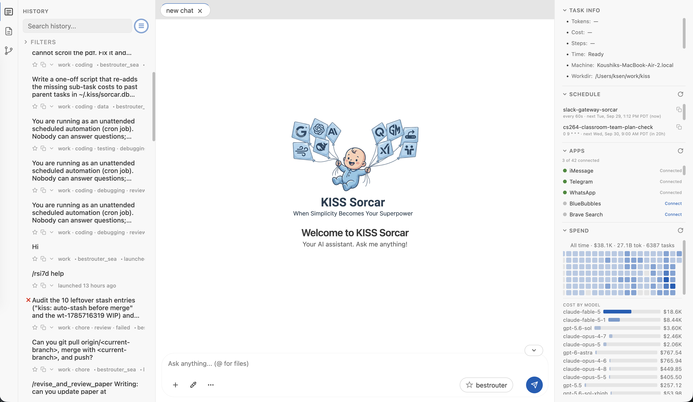
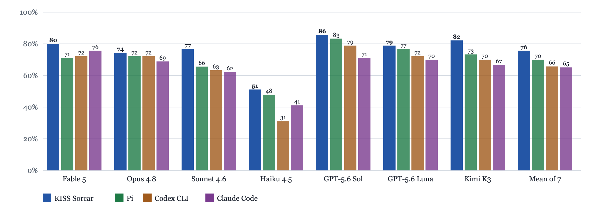

<div align="center">

<picture>
  <source media="(prefers-color-scheme: dark)" srcset="https://raw.githubusercontent.com/ksenxx/kiss_ai/main/assets/KISS-Sorcar-Logo-Dark.png">
  <source media="(prefers-color-scheme: light)" srcset="https://raw.githubusercontent.com/ksenxx/kiss_ai/main/assets/KISS-Sorcar-Logo.png">
  
</picture>

[](https://pypi.org/project/kiss-agent-framework/)
[](LICENSE)
[](https://www.python.org/)
[](https://kisssorcar.github.io/)
[](https://arxiv.org/abs/2604.23822)

*"Everything should be made as simple as possible, but not simpler." — Albert Einstein*

</div>

# KISS Sorcar

### Open-source general-purpose AI agent for long-horizon tasks and AI discovery

**KISS Sorcar is a free, simple, local-first, bring-your-own-key AI agent framework.** It runs as a VS Code extension and a browser/mobile web app, both served by a local daemon, and offers a Python client API for scripting tasks. Your prompts and code go directly to the model provider or local endpoint you configure, never through our servers. Multi-model workflows take a paragraph of prompt, not a pipeline: complex AI systems and techniques can be replaced with a paragraph of prompt in KISS Sorcar.

```bash
curl -fsSL https://raw.githubusercontent.com/ksenxx/kiss_ai/main/scripts/install.sh | bash
```

This README is the quick start. The detailed references are:

- [FEATURES.md](FEATURES.md): the complete feature inventory, checked against the source tree.
- [src/kiss/server/README.md](src/kiss/server/README.md): every `sorcar.run()` option, tools, hooks, and the Sorcar Extension Agent authoring guide.
- [src/kiss/agents/third_party_agents/README.md](src/kiss/agents/third_party_agents/README.md): the messaging and service agents, sign-in, and worked examples.
- [MODELS.md](MODELS.md): the full per-provider model list.
- [kisssorcar.github.io/docs](https://kisssorcar.github.io/docs/): installation, CLI, API, and messaging guides.

______________________________________________________________________

<details>
<summary><strong>Table of Contents</strong></summary>

- [KISS Sorcar vs Claude Code vs Cursor](#kiss-sorcar-vs-claude-code-vs-cursor)
- [Terminal-Bench 2.0](#terminal-bench-20-kiss-sorcar-vs-pi-codex-cli-and-claude-code)
- [What is in the Name](#what-is-in-the-name)
- [Installation](#installation)
- [Using KISS Sorcar](#using-kiss-sorcar)
  - [VS Code extension and web/mobile app](#vs-code-extension-and-webmobile-app)
  - [The `kiss-web` daemon](#the-kiss-web-daemon)
  - [Python client API](#python-client-api)
  - [Sorcar Extension Agents (SEAs)](#sorcar-extension-agents-seas)
  - [Skills, MCP servers, and customization](#skills-mcp-servers-and-customization)
- [Messaging & Third-Party Agents](#messaging--third-party-agents)
- [Models Supported](#models-supported)
- [Contributing](#contributing)
- [License](#license)
- [Citation](#citation)

</details>

<div align="center">
  
</div>

## Terminal-Bench 2.0: KISS Sorcar vs Pi, Codex CLI, and Claude Code

The [HarnessTax](https://harnesstax.github.io/) study (Pan, Yang, Arabzadeh, Chiang, Stoica, Zaharia; UC Berkeley and Arena Intelligence) holds the model fixed, swaps the harness between Claude Code, Codex CLI, and Pi, and finds that the harness moves cost far more than it moves what gets solved. We added KISS Sorcar to their Terminal-Bench 2.0 table: the same 30 sampled tasks, the same seven models, three attempts per task, graded by the official Terminal-Bench 2.0 verifier, with the system prompt cut to 727 words of coding rules (`papers/kisssorcar/evidence/tb2_prompt.txt`). Averaged over the seven models, **KISS Sorcar solved 75.6% of attempts; Pi 70.0%, Codex CLI 65.7%, Claude Code 65.1%**, with the best point estimate on every model.

| Model | KISS Sorcar solved | $/att. | Pi solved | $/att. | Codex CLI solved | $/att. | Claude Code solved | $/att. |
|---|---:|---:|---:|---:|---:|---:|---:|---:|
| Claude Fable 5 | **80.0** | 1.50 | 71.1 | 1.08 | 72.2 | 0.98 | 75.6 | 1.55 |
| Claude Opus 4.8 | **74.4** | 1.21 | 72.2 | 0.76 | 72.2 | 0.85 | 68.9 | 0.90 |
| Claude Sonnet 4.6 | **76.7** | 2.23 | 65.6 | 0.61 | 63.3 | 0.55 | 62.2 | 0.67 |
| Claude Haiku 4.5 | **51.1** | 0.39 | 47.8 | 0.25 | 31.1 | 0.21 | 41.1 | 0.26 |
| GPT-5.6 Sol | **85.6** | 0.69 | 83.3 | 0.42 | 78.9 | 0.76 | 71.1 | 1.35 |
| GPT-5.6 Luna | **78.9** | 0.05 | 76.7 | 0.04 | 72.2 | 0.06 | 70.0 | 0.10 |
| Kimi K3 | **82.2** | 1.14 | 73.3 | 0.38 | 70.0 | 0.45 | 66.7 | 0.52 |
| **Mean of 7 models** | **75.6** | 1.03 | 70.0 | 0.51 | 65.7 | 0.55 | 65.1 | 0.77 |

*Terminal-Bench 2.0, the study's 30-task sample, three attempts per task: percentage of attempts solved and cost per attempt in USD. KISS Sorcar: 630 attempts run on 25 September 2026, no turn cap, $50 budget per attempt, providers' default request parameters. The other three columns are the study's published numbers (100-turn cap, high reasoning effort, priced on a 1 September list). Bold marks the best point estimate per row.*

<div align="center">
  
</div>

Thirty tasks is a small sample (the pooled 95% interval, 63.8 to 85.9, contains all three published means), so we reran Pi ourselves, paired, on Claude Fable 5 with no turn cap and the same price table. On the study's 30 tasks KISS Sorcar solved 80.0% of attempts to Pi's 68.9%, a gap of **+11.1 points (95% interval +3.3 to +20.0)** for five cents more per attempt; on the 57 tasks the study did not sample, 82.5% to 71.9%, a gap of **+10.5 points (+2.9 to +18.7)** for 63 cents more. Only Pi was rerun, on one model, and the benchmark exercises the loop, six tools, and the coding rules with the discovery procedures, memory, reviewer, and IDE features switched off. Full write-up: [The Harness Tax, Audited](https://kisssorcar.github.io/blog/harness-tax-terminal-bench-blog.html); method and intervals: [the paper](https://kisssorcar.github.io/assets/kiss_sorcar.pdf), Section 5; per-attempt records: `papers/kisssorcar/evidence/tb2_trials.json`; the runners live in the separate `benchmarkings` package (a sibling checkout, or `KISS_BENCHMARKINGS_DIR`), which the paper scripts under `papers/kisssorcar/` locate.

## What is in the Name

**KISS Agent Framework** is a deliberately small agent runtime organized around the [KISS principle](https://en.wikipedia.org/wiki/KISS_principle) ("Keep it Simple, Stupid").
The name "Sorcar" pays homage to [P. C. Sorcar](https://en.wikipedia.org/wiki/P._C._Sorcar), the legendary Bengali magician, evoking the idea of an agent that performs feats that appear magical yet are grounded in disciplined engineering.
Note: **Sorcar** also means government in Bengali.

## Installation

### Full install from source

```bash
curl -fsSL https://raw.githubusercontent.com/ksenxx/kiss_ai/main/scripts/install.sh | bash
```

The installer targets macOS and Linux on `x86_64`, `aarch64`, and `arm64`. It installs or checks the tools KISS Sorcar needs, builds and installs the VS Code extension, waits for the daemon the extension starts, trusts the daemon's local certificate authority in your browsers (`kiss-web --trust-ca`), and opens the web app at `https://127.0.0.1:PORT`; on a remote machine it prints the cloudflared URL to open on your own device instead.

When a new release is available, the update toast in the chat panel offers **Update** and **Update when idle**; the daemon installs an idle update as soon as no task is running, and VS Code reloads its window on its own once the new extension is in place. While the installer runs (from the Update button, the web app, or `./install.sh` in a terminal), VS Code shows its current step (`[4/5] Building VS Code extension...`) as a non-blocking progress notification, read from `~/.kiss/.install-progress` and closed when the installer exits. If the update fails, run the installation command again. It will not delete your history. After an install or update the chat panel shows the tips from `src/kiss/TIPS.md` once per version. All state (history database, settings, memories, TLS material) lives in `~/.kiss`; `KISS_HOME` overrides the directory, and a white-label brand names its own through `home_dir` in `brand.json`. Executable scripts in `~/.kiss/post-install.d/` run in name order once the extension is installed and before VS Code is told to reload; a failing hook is reported and the update still completes. Branding (`src/kiss/agents/vscode/media/brand.json` and a git-ignored `.brand/` overlay for white-label builds) and the installer's steps are described in [FEATURES.md](FEATURES.md#20-installation-deployment-docker-and-release).

### Python package install

If you only want the Python package (the `kiss-web` daemon, the Python client API, and the messaging-agent entry points):

```bash
pipx install kiss-agent-framework
# or
uv tool install kiss-agent-framework
```

KISS Sorcar requires **Python 3.13+**.

### Configure model access

You can connect a Claude Code or Codex subscription, configure API keys, or register a custom endpoint.

**Subscription connection.** Use Claude Code 2.1.280+ or Codex 0.162.0+ for subscription isolation. Install the official CLI on the machine running the Sorcar daemon, then use **Settings → CLI Connections → Sign in** and **Refresh status**. Existing logins are reused. The fixed terminal commands are:

```bash
claude auth login
codex login --device-auth
```

Choose **Subscription** and select `cc/opus` or `codex/gpt-6.1-sol`. Sorcar verifies the login before execution and isolates the child process from API credentials and alternate-provider overrides. Codex subscription runs refuse a configured `openai_base_url` or `openai` provider override. New connections use Subscription mode; detected API or enterprise configurations remain available under **Existing CLI configuration**, with their billing shown in Settings. Remote users sign in on the daemon machine; Windows web users can copy the command into a terminal there.

Subscription tasks keep this billing constraint through retries, children, model switches, task updates, and commit helpers. Optional API classification is skipped. A task that requests an API model under that constraint fails with guidance; start a separate API task to use API credits. Fable is optional and requires the saved **Allow Fable usage credits** setting for any Claude subscription login, including one kept as the existing CLI configuration: noninteractive Claude requests can bill usage credits without prompting. Without that opt-in, native Claude child agents use the selected model, and Claude settings files cannot remap model aliases, add a fallback model, or call an advisor model for that run. Provider plan limits and extra-usage settings still apply.

**API connection.** Configure keys in Settings or export them before starting the daemon:

```bash
export ANTHROPIC_API_KEY=...
export OPENAI_API_KEY=...
export ZAI_API_KEY=...
export MOONSHOT_API_KEY=...
export TOGETHER_API_KEY=...
export OPENROUTER_API_KEY=...
export GEMINI_API_KEY=...
```

You can also set API keys, a custom model endpoint, and custom HTTP headers in the Settings panel of the VS Code extension or web app. The **Custom Models** section of the Settings panel registers your own models (a local vLLM/Ollama endpoint, or a provider model not in the bundled catalog); entries are stored in `~/.kiss/MY_MODELS.json` and appear in the model picker alongside the bundled catalog.

The picker also lists two bundled router agents under **Routers**: **`autorouter`** splits a task into units that have a mechanical acceptance check and dispatches those to the cheapest model tier (small, medium, frontier) that passes the check, escalating on failure, while planning, final acceptance and uncheckable work stay on the frontier model, and **`bestrouter`** runs every task on `claude-fable-5-1` and has `gpt-6-astra` review the result read-only. They are Sorcar Extension Agents (see below), not models.

Automatic task selection prefers a verified Claude subscription, then a verified Codex subscription, then configured API providers. Explicit and valid saved choices are preserved. API defaults are `claude-opus-5-5`, `gpt-6.1-sol-medium`, and `gemini-3.8-flash`. Fast helpers, such as commit-message generation, keep using configured API keys first outside subscription tasks: Claude Sonnet 5.5, GPT-6 Luna, and Gemini 3.5 Flash-Lite. Inside a subscription task they use `cc/haiku` or `codex/gpt-6-luna`. GPT-6.1 Sol uses the Responses API and supports `low`, `medium`, `high`, `xhigh`, and `max` effort.

The picker groups **CLI Models**, **API Models**, **Custom Models**, and **Routers**, then by provider and family. **Frequently Used** is ordered by usage count. CLI entries show their billing mode; API prices are USD per million input/output tokens.

Python subscription example:

```python
from kiss.server import sorcar

sorcar.run("Summarize README.md", model="cc/opus",
           model_config={"cli_billing_mode": "subscription"})
```

Python API example:

```python
from kiss.server import sorcar

sorcar.run("Summarize README.md", model="gpt-6.1-sol-medium")
```

### VS Code Extension Installation

To install only the KISS Sorcar extension, open Visual Studio Code, search for **KISS Sorcar** in the extension marketplace, install it, and relaunch VS Code. You can dismiss the API-key prompt and connect a subscription in CLI Connections, or configure an API backend before running tasks.

## Using KISS Sorcar

KISS Sorcar has three client interfaces, all served by one local daemon: the **VS Code extension**, the **remote web/mobile app**, and the **Python client API**. A fourth interface, the **`sorcar` terminal command**, runs a SorcarAgent directly in the current directory without the daemon: `sorcar -t "Summarize README.md"` runs an inline task, `sorcar -f task.txt` runs the file's content as the task (exactly one of `-t`/`-f` is required; see `sorcar --help` for the model, budget, and work-dir flags).

### VS Code extension and web/mobile app

Open the KISS Sorcar sidebar in VS Code (or the remote web app in a browser) and type or speak your task. The chat interface provides:

- `@` file/folder mentions with ranked completion from a persistent index of your working directory and home directory.
- Per-task **git worktree isolation** with auto-commit and merge on success (a bundled merge agent resolves conflicts), or an interactive merge/discard prompt; toggle both in the Settings panel.
- A pre-run **task classifier** that decides whether a task could create or modify any file in the repository (code, docs, reports, data; anything that could become git-tracked) and so needs a worktree. The rule is strict: a task that writes files is development work whatever else it involves, and the only exception is a git-only task (commit, merge, rebase, conflict resolution and nothing else). Tasks that write no files and git-only tasks skip the worktree, and simple tasks get a lite system prompt. The classifier and the agent's `decide` tool use the `~typesafe/jev-latest` decisions model through OpenRouter when the "Use Jev (decisions model)" setting is on (the default) and an OpenRouter key is configured.
- A model picker, per-task budget caps, chat history with tags and per-chat summaries, a **Task Info** view (tokens, cost, steps, time, budget, model, and the ids of the task and its parent), a **Working directory** panel (one daemon-wide directory, persisted in `~/.kiss/config.json`, that every task from every surface runs in unless the `run()` call or the task's SEA names another, as the channel agents' `~/.kiss/channel_work` does; the panel or the Explorer's "Set as Working Directory" check mark changes it for all connected clients at once), and inline rendering of tool-generated images.
- **Image and PDF attachments** via the picker, paste, or drag-and-drop.
- **Persistent agent memory** (on by default): Markdown pages under `~/.kiss/memories` with a vector index, plus a per-repository memory for tasks run inside a git checkout. Toggle it in Settings or with `KISS_USE_MEMORY=0`.
- Wake-word voice chat ("Hey Sorcar, …") via the mic button, including steering a running agent by voice.
- Live steering: inject a message into a running agent or switch its model mid-run; wrap the message in `<task>…</task>` to queue it as the next task instead.
- When an agent asks you a question, every surface brings its tab forward and the composer becomes the answer box; a tab that is not in front shows a `?` badge ("Waiting for your answer") until the question is answered on any device, the task ends, or the tab closes.
- Tab mirroring: every VS Code window and web client shows the same chat tabs, whatever folder each has open (the daemon owns the one canonical tab list and binds each chat to at most one tab), and a sub-agent opens a nested tab of its own on every surface that closes when it finishes. There is no row of chat tabs: the chat on screen is the one you pick in the Chats panel or open with **+** (in VS Code's editor-tabs mode the editor tabs stand for the chats), and a group strip under it lists that chat's sub-agent tabs plus, where the chat and its files share one surface (the VS Code sidebar, the mobile web app), the file, browser and terminal tabs the task opened; the strip is hidden for a single conversation. The desktop web app splits the window instead: the chat on the left keeps the strip, and the content tabs get a row of their own on the right.
- A **Browser tab** that streams a real browser running next to the daemon to every surface; an agent's `show_browser()` moves the page it is browsing into that tab when a login, CAPTCHA, or live demo needs you.
- Scheduled automations: ask in plain language ("every weekday at 9am, summarize my unread Slack messages") and the built-in cron agent (`kiss-cron` from the shell) creates, lists, pauses, resumes, or removes the schedule. Schedules are kept in Pacific time, and a job can deliver its result to a messaging channel. Like cron, the scheduler does not catch up on occurrences missed while the daemon was down: a repeating job found more than ten minutes overdue is rescheduled from now without running (a one-shot job still runs, late).

The remote web app is the same interface served over a cloudflared tunnel: copy the URL and password from the Settings panel and open it on any device; the browser tab is titled `KISS Sorcar: <machine name>` so several servers are easy to tell apart. The daemon also posts each new tunnel URL, followed by the machine name in parentheses, to a private per-machine ntfy.sh topic linked from the same panel, so a phone subscribed to the topics of several machines can tell their URLs apart after a restart. Its desktop mode adds a **Task Info sidebar** with live token, cost, and step metrics and a **Task update** for the running task (the `/ask` agent's short answer to what the task has done so far, first requested a minute after the task starts, refreshed every ten minutes or on demand with the refresh button, and charged to the task), plus **Schedule**, **Apps** (channel sign-in state; click one to connect it), and **Spend** panels, and an activity bar with an **Explorer** (workspace file tree with Ctrl/Cmd-click, Shift-click, and Ctrl/Cmd+A multi-select; **Add Folder to Explorer...** offers the Working directory panel's recently opened folders) and a **Source Control** view (changes grouped per worktree, with foldable sections, and a commit graph whose file rows open a side-by-side diff). File links open in **content tabs** with a Monaco editor, Markdown/HTML preview, and a PDF viewer, and the "..." menu's **Terminal** item opens a shell on the daemon's machine in a tab (xterm.js; the web app only, since a VS Code window has its own terminal). Sections 15 to 19 of [FEATURES.md](FEATURES.md) describe each of these in full.

### The `kiss-web` daemon

The `kiss-web` daemon hosts the agents, chat sessions, and the web app, and services every client command over WSS (port 8787 by default). Browsers sign in with the password from Settings; same-machine clients (the VS Code extension, the Python client, cron jobs, and channel agents) present a per-start token the daemon writes to `~/.kiss/sorcar-local.json` (`KISS_SORCAR_LOCAL` overrides the path). The VS Code extension starts it automatically; you can also manage it yourself:

```bash
# Start the daemon (serves the web app and the extension).
kiss-web

# Pin the daemon's working directory.
kiss-web --workdir "$HOME/projects/my-repo"

# Print the active remote (cloudflared) URL and exit.
kiss-web --url

# Trust the daemon's TLS certificate in this user's browsers and exit.
kiss-web --trust-ca
```

The web app is always served over HTTPS. The Local and LAN URLs use a certificate issued by a machine-local certificate authority kept in `~/.kiss/tls/`; `kiss-web --trust-ca` installs it in the browsers on the daemon's machine, and a phone or tablet on the same network installs it from `https://<lan-ip>:PORT/ca.crt` (compare the SHA-256 fingerprint the command prints). The CA key never leaves `~/.kiss/tls/`, and the server certificate is re-issued automatically when it expires or the LAN address changes.

### Python client API

Any Python process can run a task on the daemon with `kiss.server.sorcar.run` and block until it finishes (up to `timeout`, one hour by default):

```python
from kiss.server import sorcar

result = sorcar.run("Summarize README.md", work_dir="/path/to/repo")
print(result.text, result.success, result.cost, result.tokens, result.steps)

# Continue the same chat (the agent sees the prior task as context):
follow_up = sorcar.run("Now fix the typos you found", chat_id=result.chat_id)
```

`run()` accepts keyword options mirroring the chat interface (`model`, `work_dir`, `chat_id`, `use_worktree`, `auto_commit`, `max_budget`, `model_config`, `use_web_tools`, `use_memory`, `tool_profile`, `docker_image`, `timeout`, and more) plus options that customize the agent itself: `system_prompt`, `add_to_system_prompt`, `add_to_prompt`, and `sea_path` (run a Sorcar Extension Agent — a Python file whose `settings()` configures the run and whose `tools()` supplies extra tool functions, imported and run in the daemon process). Every option is documented in [src/kiss/server/README.md](src/kiss/server/README.md).

### Sorcar Extension Agents (SEAs)

A **Sorcar Extension Agent (SEA)** is a Python file, `<name>/<name>_sea.py`, that defines one class deriving from one of the three base classes in `kiss.agents.seas.base.base_sea`; you pass the file's path as `sea_path` to `sorcar.run()` (or as the `agent` of the `run_agent` tool). The daemon executes it on every run, instantiates the class and calls the methods it defines; every method on `BaseSea` passes its input through (its one rule of its own is the `summary` cadence: a run that has the `summary` tool must call it at every tenth step, and every other tool call but `finish` is refused until it does). What a SEA *is* is its base class: `BaseSea` is an ordinary Sorcar session with the caller's or the user's settings; `WorkerSea` is a focused tool-bound run on the caller's tree (it lays `WORKER_DEFAULTS` under the subclass's settings: no worktree, no auto-commit, no classifier, no browser, no memory); `ChannelSea` is a worker that serves an external service from `$KISS_HOME/channel_work` (unless its own `work_dir` says otherwise, as `/cron`'s `cron_work` does), holds its channel workspace, gets the channel preamble, never inherits from a calling task and has `work_dir` and the worker keys locked (every behaviour is listed in `sea_settings.CHANNEL_BEHAVIOURS`). `settings(self, settings)` receives the dict the base classes built and returns the dict to use (`settings | {...}`): any of `run()`'s per-run parameters (`model`, `max_budget`, `tool_profile`, `work_dir`, `chat_id`, `use_worktree`, `auto_commit`, `use_web_tools`, `use_memory`, `auto_classify`, `model_config`, `docker_image`), plus `timeout` (seconds a `run_agent` call waits for the script before handing back a job id; 3600 by default), `locked` (keys an explicit `run_agent` argument may not change) and `hidden` (`True` keeps the SEA out of the command list, so it is no `/command` and no `run_agent` agent name; it is still loadable by path and as a base class, and the hidden `sorcar` SEA is what an empty `agent` means). The former `kind`, `preset`, `channel`, `allow_fan_out`, `is_parallel`, `inherit`, `extends`, `append_basic_tools` and `append_to_*`/`add_to_*` prompt keys are refused with a message explaining what took their place (`sea_settings.REMOVED_SETTINGS`). A relative `work_dir`, in a SEA or a call's option, is a path under the calling task's directory. A subclass's keys override its base's defaults; an explicit `run_agent` argument or option overrides the SEA's value unless the SEA lists the key in `locked`, and parameters the SEA leaves out keep the caller's values (the daemon's defaults for a channel, which inherits nothing from the calling task, or when the call passes `inherit: false`). `settings()` is data; text and code come from the other methods: `prompt(self, task)` receives the task text and returns the prompt body (`{task_id}` in it becomes the calling task's id), `system_prompt(self, system_prompt)` receives the assembled system prompt and returns the one to use (return your own text to replace it, `system_prompt + "\n\n" + more` to append), `tools(self, tools)` receives the run's toolset and returns the run's (`tools + [mine]` adds tool callables to the built-in toolset; `"tool_profile": "none"` drops the built-in toolset so the returned callables plus `finish` are the agent's entire tool set). A SEA builds on another by Python inheritance (`class MySea(ShSea)`, or `sea_class("sh")` from `kiss.agents.sorcar.sea_commands`); the launcher applies the base class's methods first, so methods never call `super()`. Every command SEA also defines `description()`, one sentence that `/<name> help` prints; `/<name> check` loads the class and prints its inheritance chain, effective settings, model, tools, defined methods and the sample prompt a run would use, or the first error. From the shell, `sea lint [paths] [--fix] [--registered]` checks SEA files against the same contract (every bundled SEA by default; `--registered` adds the ones your `SEAS.md` lists; `--fix` rewrites renamed and removed keys, old base classes and verdicts), and `sea docs [--check]` regenerates the settings, option and command tables in the docs. Two hook methods, `llm_call_hook(self, new_messages)` and `tool_call_hook(self, name, args)`, run before each model call and tool call of the task's executor sessions (internal helper sessions and `run_parallel` sub-agents are not hooked; a tool hook returns a `Verdict`: `refuse(text)` suppresses the call and hands *text* to the model, `ALLOW` lets it run; both come from `base_sea`). One file is a complete custom agent:

```python
# weather/weather_sea.py — a minimal SEA
from typing import Any

import requests

from kiss.agents.seas.base.base_sea import WorkerSea


def get_weather(city: str) -> str:
    """Return current weather for a city from wttr.in.

    Args:
        city: City name to look up.
    """
    resp = requests.get(f"https://wttr.in/{city}?format=3", timeout=10)
    resp.raise_for_status()
    return resp.text.strip()


class WeatherSea(WorkerSea):
    def description(self) -> str:
        return "Reports the current weather in San Francisco from wttr.in."

    def settings(self, settings: dict[str, Any]) -> dict[str, Any]:
        """A worker run whose only tools are get_weather and finish."""
        return settings | {
            "max_budget": 0.50,
            "tool_profile": "none",
        }

    def prompt(self, task: str) -> str:
        return f"Look up the current weather in {task or 'San Francisco'} and report it."

    def system_prompt(self, system_prompt: str) -> str:
        return ("You are a weather assistant. Use the get_weather tool "
                "to look up weather, then call finish with the result.")

    def tools(self, tools: list[Any]) -> list[Any]:
        """With tool_profile "none" above, get_weather and finish are the whole tool set."""
        return tools + [get_weather]
```

```python
from kiss.server import sorcar

result = sorcar.run("placeholder", sea_path="weather/weather_sea.py")
```

**Slash commands.** Every SEA folder in a scanned folder is also a chat command: `/xxx some text` runs `xxx/xxx_sea.py` directly in the tab with "some text" as the task, the SEA's settings, system prompt, and tools applied to that very run (no relay turn by the chat agent and no nested sub-agent tab); `/xxx help` prints the SEA's `description()` without a model call. The same SEA runs as a sub-task of any task through `run_agent(agent="xxx", task=...)`. The channel agents are registered this way (`/slack`, `/gmail`, ...), and so are 15 of the 17 bundled SEAs in `src/kiss/agents/seas/`: `/ask` (answer a question about the current task from its persisted events), `/sh` (run a shell command), `/rsi7d` (seven-day recursive self-improvement of the bundled SEAs from their logged runs), `/merge` (resolve a conflicted git merge), `/task_update` (progress report on a task), `/autorouter` and `/bestrouter` (the model routers above), `/skillopt` (optimize a skill or prompt constant against an evaluation set), `/write_paper`, `/review_paper`, and `/revise_and_review_paper` (write, review, and iterate on a research paper), `/git_extract_knowledge` (build and maintain a repository's durable memory), `/write` (prose for a general audience), and `/remember` and `/forget` (add or remove a standing instruction in `~/.kiss/AGENTS.md`). The other two are hidden (`"hidden": True` in `settings()`, so no slash command): `sorcar`, the plain sub-agent `run_agent` runs when `agent` is empty, and `coding`, the unattended benchmark harness whose generated per-trial SEAs are loaded by path. List your own SEA folders, one per line, in `~/.kiss/SEAS.md`; they are picked up within two seconds. The `settings()` contract, type checking, hooks, and dispatch flow are in [src/kiss/server/README.md](src/kiss/server/README.md) and [docs/sea-commands.md](https://kisssorcar.github.io/docs/sea-commands.md).

### Skills, MCP servers, and customization

- Agent Skills loaded from `~/.kiss/skills`, `<project>/.kiss/skills`, Claude skill directories, `.agents/skills`, and bundled Sorcar skills.
- MCP server discovery from `~/.kiss/mcp.json`, `<project>/.kiss/mcp.json`, and `<project>/.mcp.json`. Remote servers that follow the MCP authorization spec (Notion, Linear, Asana, or any URL) are signed into from the chat with the `connect_mcp_server` tool; tokens are stored under `~/.kiss/mcp_auth/`. A curated catalog of privacy-first MCP connectors ships in [connectors/](connectors/README.md).
- "Tricks" (inject-instruction snippets) come from your `~/.kiss/MY_INJECTION.md` and the bundled `src/kiss/INJECTIONS.md`; the Inject panel in the chat lists, inserts, edits, and deletes them.

## Messaging & Third-Party Agents

KISS Sorcar includes 44 third-party agents that act on messaging services, mailboxes, devices, and web services on your behalf. 32 are messaging-channel agents:

BlueBubbles · DingTalk · Discord · Email (IMAP/SMTP) · Feishu · Gmail · Google Chat · Home Assistant · iMessage · IRC · LINE · Matrix · Mattermost · Microsoft Teams · Nextcloud Talk · Nostr · ntfy · Phone Control · QQ · Signal · SimpleX · Slack · SMS · Synology Chat · Telegram · Tlon · Twitch · Webhook · WeCom · WeiXin · WhatsApp · Zalo

Ten more are service agents that give Sorcar authenticated API tools for productivity and data services:

Brave Search (`kiss-brave`) · Firecrawl (`kiss-firecrawl`) · GitHub (`kiss-github`) · Google Calendar (`kiss-gcal`) · Google Docs (`kiss-gdocs`) · Google Drive (`kiss-gdrive`) · Google Sheets (`kiss-gsheets`) · Notion (`kiss-notion`) · Overleaf (`kiss-overleaf`) · PostgreSQL (`kiss-postgres`)

In a chat task, just say what you want ("send 'running late' to Alice on WhatsApp", "list my open GitHub PRs") and Sorcar dispatches the matching agent through its `run_agent` tool (`run_agent(agent="whatsapp", task=...)`): the channel SEA (a class deriving from `ChannelSea`) runs in `$KISS_HOME/channel_work`, inheriting nothing from the calling task, with the channel's authenticated tools and its own system-prompt preamble. Each agent also has its own CLI entry point (`kiss-slack`, `kiss-gmail`, `kiss-whatsapp`, ...). Gateway-capable channels also work **inbound**: a recurring poll tick (ask for "an always-on Telegram gateway" in chat) runs each new message as a Sorcar task, with thread continuity, sender allow-lists, and an optional pairing handshake. Two infrastructure agents round out the set: an **A2A agent** (`kiss-a2a`) exposing Sorcar over the agent-to-agent protocol and an **OpenAI-compatible server** (`kiss-oai`).

**Sign-in.** Every service agent carries `check_<service>_auth` / `authenticate_<service>` tools, so a task can connect a service on the spot, and the Apps panel of the sidebar starts such a task when you click a service that is not connected. The six Google Workspace agents go through Composio (Google only lets verified OAuth apps request Workspace scopes, so no Google token is stored locally); GitHub, Microsoft Teams, Slack, and Discord use public OAuth apps with device-code or PKCE flows and no client secret. Every sign-in ends on a page only you may complete, shown in the Browser tab under the daemon; the agent never asks for your password or a 2FA code. On Linux, credentials for the 18 Muse-covered connectors are isolated by default behind a local auth daemon that swaps opaque surrogate tokens for the real ones at the network edge and applies an allow/deny/ask policy with an audit log (`python -m kiss.agents.third_party_agents.muse_auth`; opt out with `KISS_MUSE_AUTH=0`).

The complete catalog, credentials, and 26 worked examples are in [src/kiss/agents/third_party_agents/README.md](src/kiss/agents/third_party_agents/README.md).

## Models Supported

KISS Sorcar ships a catalog of **778 models** across **9 provider categories**, with built-in prices, context lengths, and capability flags (`fc` function calling, `gen` generation, `emb` embedding, `dec` typed decisions via OpenRouter's `/api/alpha/decisions`). The source of truth is [src/kiss/core/models/MODEL_INFO.json](src/kiss/core/models/MODEL_INFO.json); the per-provider counts and the full model list are in [MODELS.md](MODELS.md). Models are grouped by the provider that routes them, so the `cc/*` and `codex/*` namespaces (Claude Code CLI and Codex CLI) are categories of their own, and the open-weight `openai/gpt-oss-*` and `google/gemma-*` models count under Together AI, which serves them.

Cost and budget tracking use the catalog prices, except for `openrouter/*` models, where the cost OpenRouter reports for each response is billed instead, since the same model id is priced differently per upstream route. A response the adapters reject after the provider has billed it, or the usage the provider has already reported for a streamed response that Stop interrupts, still count towards the task's cost and budget, and the task total shown in the UI includes the task classifier's spend, every earlier session of a task continued after a crash, the whole spend of the sub-tasks the task dispatches with `run_agent` and `run_parallel`, and the spend of the `/ask` answers and Task update runs on its tab, including answers given while the task was still setting up.

## Contributing

Contributions in the form of issues are welcome. KISS Sorcar should be able to help implement and review them.  If you want to send a pull request (PR), please make sure that all Python and JavaScript tests pass across Mac OSX, Linux, Windows.

## License

Apache-2.0. See [LICENSE](LICENSE).

## Citation

If you use KISS Sorcar in your research, please cite:

```bibtex
@misc{sen2026kisssorcar,
  title         = {KISS Sorcar: A Stupidly-Simple General-Purpose and Software Engineering AI Assistant},
  author        = {Sen, Koushik},
  year          = {2026},
  eprint        = {2604.23822},
  archivePrefix = {arXiv},
  primaryClass  = {cs.SE},
  url           = {https://arxiv.org/abs/2604.23822}
}
```
