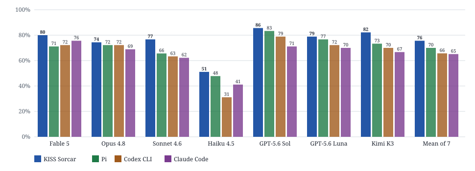
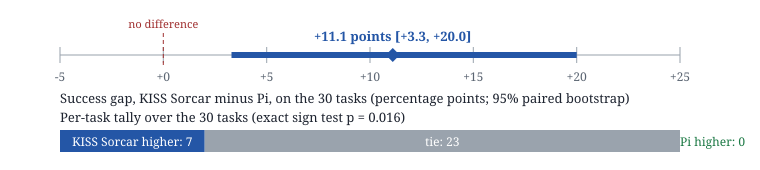
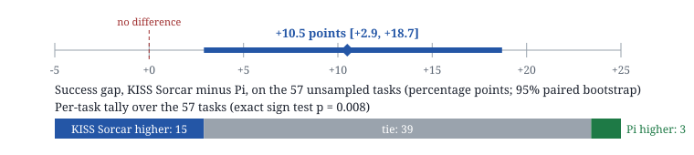

# Terminal-Bench 2.0: KISS Sorcar vs Pi, Codex CLI, and Claude Code

> KISS Sorcar on the HarnessTax study's 30 Terminal-Bench 2.0 tasks and seven models: 75.6% of attempts solved against 70.0% for Pi, 65.7% for Codex CLI, and 65.1% for Claude Code, with the best point estimate on every model; paired reruns of Pi on Claude Fable 5 put KISS Sorcar 11.1 points ahead on the study's tasks and 10.5 points ahead on 57 unsampled tasks. Full write-up: [The Harness Tax, Audited](https://kisssorcar.github.io/blog/harness-tax-terminal-bench-blog.html).

## The study

The [HarnessTax](https://harnesstax.github.io/) study (Melissa Pan, Shuo Yang, Negar Arabzadeh, Wei-Lin Chiang, Ion Stoica, and Matei Zaharia; UC Berkeley and Arena Intelligence) separates the coding model from the harness around it. It takes seven models (Claude Fable 5, Opus 4.8, Sonnet 4.6, Haiku 4.5, GPT-5.6 Sol, GPT-5.6 Luna, and Kimi K3), runs each under three harnesses (Claude Code, Codex CLI, and Pi), and scores them on 30 tasks sampled from SWE-bench Lite and 30 from Terminal-Bench 2.0, three attempts per task, graded by each benchmark's official verifier, under a 100-turn cap and "high" reasoning effort. Its central finding: on Terminal-Bench 2.0 switching harness shifts the success rate by about ±5 points on average, while Claude Code costs around 1.5× what Pi does. The name is the conclusion: accept a coding agent's default harness without trying the alternatives and you probably pay more for the same result.

KISS Sorcar was built on the opposite hunch, that a prompt full of engineering rules backed by a little code changes what the model gets right as well as what it costs. The study publishes its task list, per-model numbers, and protocol, which is what a head-to-head needs.

## What we ran

The same 30 Terminal-Bench 2.0 tasks, the same seven models, three attempts per task, graded by the Terminal-Bench 2.0 verifier. For the benchmark the general-purpose material was stripped from the system prompt, leaving 727 words of coding rules ([`papers/kisssorcar/evidence/tb2_prompt.txt`](https://github.com/ksenxx/kiss_ai/blob/main/papers/kisssorcar/evidence/tb2_prompt.txt)) instead of the 3,851 words of the full `SYSTEM.md`. Two settings differ from the study's: no turn cap and no wall-clock limit (an attempt ends when the agent calls `finish` or has spent $50), and the providers' default request parameters rather than high effort. A task's three attempts are averaged first, then the 30 tasks; the pooled figure averages the seven per-model results; intervals are percentile bootstraps over 10,000 resamples of the tasks. All 630 attempts ran on 25 September 2026 and every one of them is counted.

The six rules of the prompt, paraphrased:

1. Understand the task before acting: list what "done" means for every item it names.
2. Look before you change; never modify the task's input files, and experiment on copies instead.
3. Work in small verified steps; reproduce a bug before fixing it; never replace something that works with something unverified.
4. Verify before you finish, from a fresh shell, requirement by requirement; never weaken a test or threshold to pass a check.
5. Leave the environment as the task expects to find it.
6. Be honest at the end: `success=True` only when every requirement is met and checked.

## Results on the study's 30 tasks

| Model | KISS Sorcar solved | $/att. | Pi solved | $/att. | Codex CLI solved | $/att. | Claude Code solved | $/att. |
|---|---:|---:|---:|---:|---:|---:|---:|---:|
| Claude Fable 5 | **80.0** | 1.50 | 71.1 | 1.08 | 72.2 | 0.98 | 75.6 | 1.55 |
| Claude Opus 4.8 | **74.4** | 1.21 | 72.2 | 0.76 | 72.2 | 0.85 | 68.9 | 0.90 |
| Claude Sonnet 4.6 | **76.7** | 2.23 | 65.6 | 0.61 | 63.3 | 0.55 | 62.2 | 0.67 |
| Claude Haiku 4.5 | **51.1** | 0.39 | 47.8 | 0.25 | 31.1 | 0.21 | 41.1 | 0.26 |
| GPT-5.6 Sol | **85.6** | 0.69 | 83.3 | 0.42 | 78.9 | 0.76 | 71.1 | 1.35 |
| GPT-5.6 Luna | **78.9** | 0.05 | 76.7 | 0.04 | 72.2 | 0.06 | 70.0 | 0.10 |
| Kimi K3 | **82.2** | 1.14 | 73.3 | 0.38 | 70.0 | 0.45 | 66.7 | 0.52 |
| **Mean of 7 models** | **75.6** | 1.03 | 70.0 | 0.51 | 65.7 | 0.55 | 65.1 | 0.77 |

*Table 1. Terminal-Bench 2.0, the study's 30-task sample, three attempts per task: percentage of attempts solved and cost per attempt in USD. KISS Sorcar: 630 attempts, no turn cap, $50 budget. The other three: as published, 100-turn cap, high effort, priced on a 1 September list. Bold marks the best point estimate per row.*

*Figure 1. The success column of Table 1 as bars. KISS Sorcar (blue) has the highest point estimate on each of the seven models. The gap over Pi is largest on Sonnet 4.6 (+11.1) and Kimi K3 (+8.9) and smallest on Opus 4.8 and Luna (+2.2 each) and Sol (+2.3).*

Averaged over the seven models, KISS Sorcar solved 75.6% of attempts, with a 95% interval over tasks of 63.8 to 85.9: 5.6 points above Pi and 10.5 above Claude Code. Treating the solves that took more than 100 turns as failures, to approximate the study's cap, gives 74.1%, still above the other three.

Thirty tasks is not a lot. A per-model interval spans 27 points on average, the pooled interval contains all three published means, and the comparison with the published table differs in date, price list, turn cap, and prompt at once. No cost ratio is drawn from Table 1: the study priced its runs on a 1 September list and ours are priced with the framework's own table, which for Kimi K3 mixes two providers.

## Pi rerun on the same model, paired

Harbor's Pi agent (Pi 0.87.1) ran on Claude Fable 5 on 26 September 2026 on the same 30 tasks, three attempts each, at the study's high-effort setting, with no turn cap and no wall-clock limit (Pi has no budget cap), priced with the same table as ours. All 90 attempts count; one killed after two hours while waiting on a training command it had started is counted as failed with its spend.

Pi solved 62 of 90 attempts, 68.9% (interval 52.2 to 84.4), at $1.45 and 14.5 turns per attempt. KISS Sorcar on the same model solved 80.0% at $1.50 and 15.3 turns. Both harnesses tried every task, so the comparison is paired: tasks are resampled once and the same resample applied to both. The success gap is **11.1 points in KISS Sorcar's favor, 95% interval +3.3 to +20.0**; the cost difference is five cents per attempt, interval −$0.71 to +$0.70.

*Figure 2. The paired comparison on Claude Fable 5. Top: the success gap and its bootstrap interval, which excludes zero. Bottom: KISS Sorcar has the higher task mean on 7 tasks, Pi on none, and 23 are ties, 20 of them solved by both on every attempt.*

Pi's three attempts on `feal-linear-cryptanalysis` all died with an API error (two on a Pi client bug on a mid-output model fallback, one on a content filter). Without that task the gap is +8.0 points (6 tasks to 0, sign test *p* = 0.031). Codex CLI and Claude Code were not rerun, so the paired claim is about Pi, on one model.

## The 59 tasks the study left out

A harness tuned on a public sample can look good on that sample and nowhere else. The same agent and frozen prompt ran on Claude Fable 5 on the 59 Terminal-Bench 2.0 tasks the study did not sample, three attempts each, under the same protocol. It solved 79.1% of attempts on the unsampled tasks and 79.4% across all 89 (counting one stopped attempt on `extract-moves-from-video` as failed). On the 176 attempts that ran to completion the unsampled tasks come out at 79.7% (70.1 to 88.1) against 80.0% on the study's 30; the interval on that difference, −15.8 to +15.4, is far too wide to call a gap. These tasks cost $1.60 per attempt against $1.50 and ran longer (17.2 turns against 15.3).

Pi then ran the same 59 tasks on 29 and 30 September under the terms of the first rerun. Two tasks, `qemu-startup` and `qemu-alpine-ssh`, are out of the head-to-head: their test script installs curl from a Debian 11 repository that now answers 404, the verifier failed all six of our attempts before running a test, and a repair added for Pi's installer left the verifier working inside Pi's containers, so the two harnesses were not scored alike there (our six attempts still count as failures in the 79.1%).

On the other 57 tasks Pi solved 123 of 171 attempts, 71.9% (61.4 to 81.9), at $1.00 and 12.3 turns per attempt; KISS Sorcar solved 82.5% at $1.63 and 17.3 turns. The paired gap is **10.5 points, 95% interval +2.9 to +18.7**: KISS Sorcar has the higher task mean on 15 tasks, Pi on 3, and 39 are ties (sign test *p* = 0.008). Counting our stopped attempt as failed, the gap is 9.9 points (+1.8 to +18.1, *p* = 0.019); with the two qemu tasks kept, 6.8 points (−2.3 to +15.8, *p* = 0.041). Here the cost difference does not straddle zero: KISS Sorcar paid 63 cents more per attempt (+$0.31 to +$1.03), spent on turns.

*Figure 3. The paired comparison on the 57 unsampled tasks the verifier scored alike for both harnesses. Top: the success gap and its bootstrap interval. Bottom: KISS Sorcar has the higher task mean on 15 tasks, Pi on 3, and 39 are ties, 32 of them solved by both on every attempt.*

## What the trajectories look like

The average attempt took 27.9 turns (the longest, 276) and 17.2 minutes. Twenty-eight attempts went past the study's 100-turn cap and 9 of those were solved. Three attempts cost more than $15 (the most expensive, $33.64) and two of those were solved. Of the 630 attempts, 250 received at least one harness note about a still-running process or a changed input file, 901 notes in total: Terminal-Bench tasks routinely start a server, a build, or a training job that is still running when the agent reads the next result, and the verifier looks at files the agent may have brushed against by accident. The harness refused 15 tool calls in 15 different attempts, 14 of them `run_agent` calls that have no channel agent to reach inside a container.

## Where this leaves the harness tax

HarnessTax puts the harness effect on Terminal-Bench 2.0 within about ±5 points. The pooled gap over Pi is 5.6 points, at the edge of that band; the paired gaps on one model are 11 points on the study's tasks and 10.5 on 57 of the others, both with intervals that leave out zero. The study stands; the band a fourth harness draws is wider than the one three harnesses drew. KISS Sorcar's harness sends the model little more than Pi does; what it adds is a short account of how to work and a one-line note whenever the model cannot see something important in a shell result. Whether those two things are what moved the numbers has not been tested: settling it means varying the prompt, the notes, and the guard one at a time with everything else held fixed.

## Things to keep in mind

- Only Pi was rerun, on one model, at high effort with its own prompt and no budget cap, after our runs.
- The pooled seven-model comparison changes effort, turn cap, and date at once; the paired runs leave effort and prompt tangled together.
- Two of the 59 unsampled tasks are out of the head-to-head because the verifier did not treat the two harnesses alike; with them in, that gap shrinks to 6.8 points.
- The benchmark exercises the loop, six tools, and the coding rules. The discovery and adversarial-testing procedures, the memory, the reviewer, and the IDE features were switched off.

## Reproducing

- Runners and the Pi subclass: [`benchmarkings/harnesstax/`](https://github.com/ksenxx/kiss_ai/tree/main/benchmarkings/harnesstax) (`tb2_runner.py` launches one Harbor job per model over the 30 sampled tasks; `pi_agent.py` is Harbor's built-in Pi agent pinned to the current `@earendil-works/pi-coding-agent` package; `results/pi/README.md` records the Pi rerun command).
- Per-attempt records of all four runs (`main`, `heldout`, `pi`, `pi_heldout`): [`papers/kisssorcar/evidence/tb2_trials.json`](https://github.com/ksenxx/kiss_ai/blob/main/papers/kisssorcar/evidence/tb2_trials.json); the benchmark prompt: [`tb2_prompt.txt`](https://github.com/ksenxx/kiss_ai/blob/main/papers/kisssorcar/evidence/tb2_prompt.txt).
- Method, intervals, and the rest of the evidence: [KISS Sorcar: A Stupidly-Simple General-Purpose and Software Engineering AI Assistant](https://kisssorcar.github.io/assets/kiss_sorcar.pdf), Section 5.
- Terminal-Bench 2.0: Merrill et al., [arXiv:2601.11868](https://arxiv.org/abs/2601.11868). Pi: [github.com/earendil-works/pi](https://github.com/earendil-works/pi). HarnessTax: [harnesstax.github.io](https://harnesstax.github.io/).
